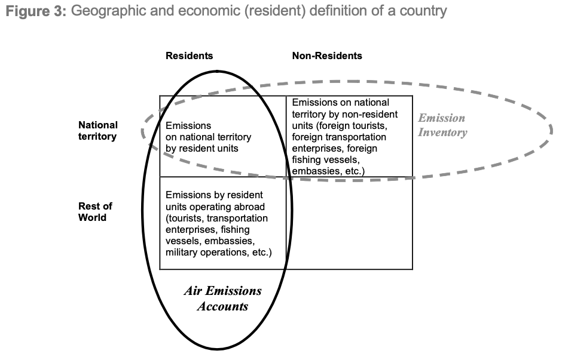
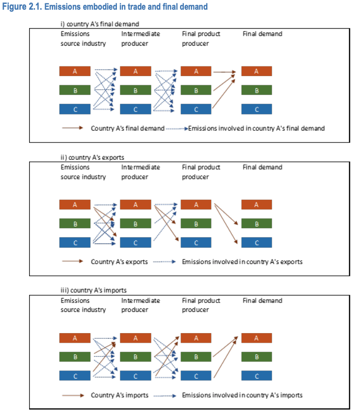

```{r}
#| label: datos-oecd
library(ggplot2)

# Anexos D y E de Yamano y Guilhoto (2020), millones de toneladas de CO2
oecd <- data.frame(
  pais = c("Perú", "Chile", "Colombia", "México", "Argentina", "Brasil", "Costa Rica"),
  prod_2005 = c(28.7, 61.3, 56.5, 423.6, 152.3, 321.1, 6.2),
  prod_2015 = c(49.2, 86.7, 82.8, 453.0, 195.0, 461.2, 8.0),
  dem_2005 = c(31.3, 61.1, 63.6, 449.4, 141.2, 312.8, 9.0),
  dem_2015 = c(63.6, 89.2, 97.4, 485.5, 216.0, 475.4, 13.5),
  pc_2005 = c(1.1, 3.8, 1.5, 4.1, 3.6, 1.7, 2.1),
  pc_2015 = c(2.0, 5.0, 2.0, 3.9, 5.0, 2.3, 2.8),
  ext_2005 = c(32.4, 39.4, 29.6, 22.7, 16.7, 20.4, 49.8),
  ext_2015 = c(36.6, 36.0, 34.0, 26.9, 18.3, 21.7, 52.1)
)
```

```{r}
#| label: datos-uk

# Figure 8 del conjunto de datos de Defra (2026), MtCO2e
uk <- data.frame(
  anio = 1996:2023,
  consumo = c(826.2, 837.1, 884.8, 875.8, 869.8, 863.4, 908.8, 918, 967.6, 956.5, 960.5, 983.8, 914.1, 819.9, 839.3, 822.1, 836.3, 824.6, 815.1, 785.1, 762.3, 713.3, 746.6, 730.5, 630.8, 682, 726.6, 699.2),
  produccion = c(825.1, 809.6, 813.6, 784.4, 787.9, 795.4, 772.1, 779.6, 779.1, 775.6, 761.5, 751.8, 730.7, 671.6, 689.6, 648.8, 662.8, 651.1, 616.5, 603.3, 580.7, 567.4, 567.5, 551.7, 495.1, 504.2, 500.9, 479.2),
  territorial = c(763.5, 739.7, 738.8, 710.7, 712.3, 716.3, 694.9, 703, 699.4, 692.3, 688.3, 674.8, 652.7, 596.9, 612, 567.8, 585.1, 573, 530.7, 510.7, 483.2, 471.8, 464.1, 447.5, 407.5, 422.2, 404, 383.9)
)
```

## Introducción

Los compromisos internacionales de mitigación se miden, en general, con inventarios de emisiones que registran lo que ocurre dentro del territorio de cada país [@eurostat2015]. Ese enfoque tiene ventajas claras: se apoya en estadísticas de combustibles y en metodologías acordadas, y permite verificar el cumplimiento de metas. Deja fuera, sin embargo, una pregunta que cobra importancia en el debate de política: cuántas emisiones se generan para sostener el consumo de un país, incluidas las que ocurren en otros países que producen los bienes que ese país importa.

La magnitud de esa diferencia es considerable. Estudios de referencia estiman que entre una quinta parte y algo más de una cuarta parte de las emisiones mundiales de CO2 se asocia con bienes que cruzan fronteras [@davis2010; @peters2011; @yamano2020]. La distinción también tiene consecuencias para el diseño de políticas. Cuando los países con metas ambiciosas reducen sus emisiones territoriales, parte de la reducción puede reflejar el traslado de producción a economías con tecnologías más intensivas en carbono, de modo que las emisiones regresan al consumo del país en forma de importaciones [@yamano2020]. El debate sobre qué parte de la carga de mitigación corresponde a cada país, que se remonta al principio de responsabilidades comunes pero diferenciadas del Protocolo de Kioto, depende en buena medida de cómo se asignen las emisiones [@yamano2020].

La huella de carbono nacional responde a esa pregunta. Es una estadística que asigna a la demanda final de los residentes de un país las emisiones generadas en toda la cadena de producción, dentro y fuera de su territorio. Varias oficinas de estadística y organismos internacionales la publican de forma regular, entre ellos el Departamento de Medio Ambiente del Reino Unido y Eurostat [@defra2026; @eurostatghgfp]. Su cálculo descansa en las cuentas de emisiones atmosféricas del Marco Central del SEEA, que comparten la estructura de los cuadros de oferta y utilización de las cuentas nacionales y pueden, por tanto, combinarse con ellos en un modelo de insumo-producto [@eurostat2015; @seea2014].

Esta nota ofrece una introducción al tema para quienes compilan o utilizan estas estadísticas. La sección 2 aclara el concepto y lo distingue de otros usos del término. La sección 3 describe el método, y la sección 4 resume los usos de política. La sección 5 presenta la evidencia global y la posición de América Latina, y la sección 6 revisa las experiencias de oficinas de estadística, de bases de datos multirregionales y de estudios latinoamericanos. La sección 7 reúne las consideraciones de diseño. El documento se limita a la huella nacional basada en la demanda final; las huellas de producto y de organización se mencionan solo para evitar confusiones. Dos anexos completan el documento: el anexo A ofrece un glosario de términos técnicos, y el anexo B describe el contexto de la asistencia técnica del FMI al Instituto Nacional de Estadística e Informática (INEI) de Perú, que motivó la preparación de esta nota.

## El concepto de huella de carbono

### Un término con varios significados

La expresión huella de carbono se usa con sentidos distintos y no existe una definición de aceptación general [@espindola2012]. En el ámbito empresarial predominan las huellas de producto y de organización. Se calculan con métodos de abajo hacia arriba, como el análisis de ciclo de vida, y siguen referencias como el GHG Protocol, la especificación PAS 2050 o las normas ISO 14040 y 14044 [@espindola2012; @frohmann2013]. Una empresa que mide las emisiones de su producción, o de un producto a lo largo de su vida útil, produce una huella de este tipo.

Las estadísticas oficiales usan el término con otro sentido. El Reino Unido, que publica una serie oficial desde 2012, define su huella como las emisiones de gases de efecto invernadero asociadas con el gasto de consumo de los residentes, en cualquier lugar del mundo donde ocurran a lo largo de la cadena de suministro, más las emisiones directas de los hogares por el uso de combustibles [@defra2026]. El manual de Eurostat describe la misma perspectiva como cuentas de emisiones basadas en el consumo, que resultan de un modelo y se conocen también como huellas de carbono [@eurostat2015, sección 8]. Ese es el sentido que se adopta en esta nota.

El término tiene además una historia más larga que su uso reciente. Los métodos de insumo-producto en que se apoya la huella nacional se remontan a los trabajos de Leontief de la década de 1970, y la literatura sobre huellas creció con rapidez en los años previos a 2012 [@espindola2012]. Las definiciones difieren según la fuente: algunas miden solo CO2 y otras toda la canasta de gases del Protocolo de Kioto; algunas se limitan a las emisiones directas y otras incluyen toda la cadena de suministro. Los métodos también tienen ventajas y costos distintos. El de abajo hacia arriba modela procesos concretos y es preciso para un producto definido, pero corta la cadena en un límite arbitrario, lo que genera un error de truncamiento de tamaño desconocido. El de insumo-producto cubre toda la economía a costa de usar promedios sectoriales. Por eso una propuesta frecuente es combinar ambos en un enfoque híbrido [@espindola2012]. Tampoco existe una norma internacional única: la norma ISO 14067 sobre huella de producto quedó como especificación técnica y no como norma [@frohmann2013].

### Tres formas de asignar las emisiones

Para entender qué mide la huella conviene situarla frente a otras dos formas de contar las emisiones. La OCDE distingue tres enfoques de asignación [@yamano2020], que resume el @tbl-enfoques. El primero es el territorial, propio de los inventarios que los países reportan a la Convención Marco de las Naciones Unidas sobre el Cambio Climático (CMNUCC) y de las estadísticas de la Agencia Internacional de Energía (AIE). El segundo es el de producción, o de residencia, que sigue la lógica de las cuentas nacionales y se aplica en las cuentas de emisiones atmosféricas. El tercero es el de demanda final, que corresponde a la huella.

| Enfoque | Qué cuenta | Fuentes típicas | Pregunta que responde |
|:-----------------|:-----------------|:-----------------|:-----------------|
| Territorial | Combustibles comprados y quemados en el territorio, incluidos los de no residentes | Inventarios de la CMNUCC y estadísticas de la AIE | ¿Cuánto se emite dentro de las fronteras? |
| Producción (residencia) | Emisiones de industrias y hogares residentes, dentro y fuera del territorio | Cuentas de emisiones atmosféricas (SEEA) | ¿Qué actividades económicas emiten? |
| Demanda final (huella) | Emisiones de todas las etapas de producción asociadas con la demanda final de los residentes | Cuentas de emisiones y tablas de insumo-producto | ¿Qué consumo, inversión o exportación provoca las emisiones? |

: Enfoques de asignación de emisiones

Los tres enfoques son consistentes entre sí. A escala mundial, las emisiones basadas en la demanda y las basadas en la producción suman lo mismo; la diferencia aparece entre países, como resultado del comercio [@yamano2020]. Un país cuyo consumo depende de bienes importados intensivos en emisiones tendrá una huella mayor que sus emisiones de producción, y lo contrario ocurre en un país exportador de esos bienes.

### Territorio y residencia

La diferencia entre el primer y el segundo enfoque merece atención, porque es la que más ajustes exige al compilar. Las cuentas de emisiones atmosféricas registran las emisiones de las unidades residentes de una economía, sin importar dónde ocurren, con el mismo criterio de residencia de las cuentas nacionales. Los inventarios de la CMNUCC, en cambio, siguen el principio territorial y registran lo emitido en el territorio, sin importar quién lo emite [@eurostat2015, párr. 3 y 37].

El manual de Eurostat ilustra la diferencia con una aerolínea residente en Irlanda: las emisiones de uno de sus vuelos entre Fráncfort y Nueva York se registran en la cuenta irlandesa, porque la utilidad del vuelo contribuye al producto interno bruto de Irlanda [@eurostat2015, párr. 35]. Lo mismo vale para embarcaciones pesqueras, camiones de carga y turistas que conducen vehículos en el extranjero: las cuentas asignan las emisiones al operador del vehículo y a su país de residencia [@eurostat2015, párr. 40]. En economías pequeñas, con mucho tránsito internacional, las diferencias entre ambos criterios pueden ser grandes en relación con los totales nacionales [@eurostat2015, párr. 36].

Los compiladores hacen explícita la conciliación entre ambos criterios mediante las llamadas partidas puente, que muestran las diferencias entre el total de la cuenta y el total del inventario. El transporte internacional es la fuente principal de esas diferencias [@eurostat2015, párr. 39]. La @fig-residencia ilustra la diferencia con dos elipses: una delimita las emisiones de los residentes, que incluye lo que ocurre en el resto del mundo, y la otra las del territorio, que incluye lo que emiten los no residentes.

{#fig-residencia}

### Gases y unidad de medida

Las cuentas cubren seis gases de efecto invernadero: CO2, N2O, CH4, HFC, PFC y SF6, con el NF3 incorporado recientemente al reporte. Se expresan en CO2 equivalente mediante potenciales de calentamiento global [@eurostat2015, sección 3.1]. Algunas fuentes, como la serie de la OCDE que se usa en la sección 5, incluyen solo el CO2 por combustión de combustibles fósiles [@yamano2020]. La diferencia importa en economías donde la agricultura o el cambio de uso de suelo pesan mucho en las emisiones totales, porque esas fuentes quedan fuera de las series de combustión.

## Metodología

### Datos necesarios

El cálculo de una huella nacional combina tres insumos: tablas de insumo-producto, que pueden derivarse de los cuadros de oferta y utilización; medidas de las emisiones directas; y cuentas de emisiones atmosféricas, que asignan las emisiones a las actividades económicas con las mismas clasificaciones de las cuentas nacionales. Estas últimas siguen las estructuras y los principios del Marco Central del SEEA y son coherentes con los datos monetarios del Sistema de Cuentas Nacionales [@seea2014; @sna2009].

Esa coherencia es lo que vuelve posible el modelo: como las cuentas físicas y los cuadros monetarios comparten clasificaciones, las emisiones por industria pueden vincularse directamente con el producto de cada industria. La cuenta debe además tener el desglose completo por actividad económica (en Eurostat, la lista A\*64 de la NACE); sin él, las huellas y las descomposiciones no son posibles o pierden valor [@eurostat2015, párr. 118].

La compilación de la cuenta de emisiones, que suele ser el insumo menos familiar para una oficina de cuentas nacionales, admite dos rutas según el manual de Eurostat. En la primera se parte de los inventarios que se reportan a la CMNUCC y se reasignan a industrias y hogares. En la segunda se parte de las estadísticas de energía, idealmente de las cuentas físicas de flujos de energía, que ya siguen el criterio de residencia, y se aplican los mismos factores de emisión del inventario para la combustión, mientras las emisiones que no provienen de la combustión se toman de los inventarios [@eurostat2015, párr. 141 a 151]. La combustión explica hasta cerca de 90% del CO2 [@eurostat2015, párr. 133]. Sigue el ajuste por residencia: se restan las emisiones de no residentes en el territorio y se suman las de residentes en el exterior. El manual recomienda concentrarse en las partidas grandes y no gastar esfuerzo en ajustes teóricamente correctos pero pequeños [@eurostat2015, párr. 190], y reconoce que el transporte por carretera es una de las partes más difíciles [@eurostat2015, párr. 280]. Advierte además que un desglose incompleto por actividad, o la marcación como confidenciales de celdas que no lo son, puede impedir los modelos de huella [@eurostat2015, párr. 117 a 121].

### Cálculo

La idea del cálculo es sencilla. Cada industria emite una cantidad conocida por unidad de producto, pero para producir un bien necesita insumos de otras industrias, que a su vez emiten y necesitan insumos. El modelo de insumo-producto suma todas esas rondas de producción, y por eso la huella de un producto incluye las emisiones de sus proveedores directos e indirectos [@millerblair2022]. Sea $\boldsymbol{\varepsilon}$ el vector de coeficientes de emisión por industria (emisiones directas divididas entre el producto bruto), $\mathbf{T}$ la matriz de requerimientos totales del modelo de producto por industria y $\mathbf{f}$ el vector de demanda final por producto. La huella de la demanda final es:

$$
F = \boldsymbol{\varepsilon}'\,\mathbf{T}\,\mathbf{f} + e_h
$$

donde $e_h$ son las emisiones directas de los hogares, como el uso de combustibles para transporte y cocción. La OCDE usa una expresión equivalente, $C = \mathbf{eB}\,\mathbf{Y} + HE$, con la inversa de Leontief de una tabla multirregional [@yamano2020, ecuación 7a].

Un ejemplo del manual de Eurostat aclara la lógica de la asignación. En una economía hipotética sin comercio exterior, el total emitido por las industrias coincidiría con el total asociado con la demanda final. Aun así, las emisiones de la industria A no coincidirían con las emisiones asociadas con el uso final del producto A, porque parte de la producción de A es insumo de otros productos y porque producir A requiere insumos de otras industrias [@eurostat2015, párr. 332]. La huella reasigna las emisiones desde donde se producen hacia el uso final que las origina.

Al descomponer $\mathbf{f}$ por producto y por categoría de uso final (consumo de los hogares, consumo del gobierno, formación bruta de capital y exportaciones) se obtienen las dimensiones de análisis habituales [@eurostat2015, párr. 337]. Incluir la formación de capital es importante: en el análisis global de @hertwich2009, los hogares explican 72% de la huella de gases de efecto invernadero, el gobierno 10% y la inversión 18% (según el resumen del artículo). En una economía abierta, el total asociado con toda la demanda final, exportaciones incluidas, coincide con las emisiones de producción cuando se contabilizan por completo las emisiones incorporadas en las importaciones [@eurostat2015, párr. 338].

### Tratamiento de las importaciones

La decisión metodológica más delicada es cómo estimar las emisiones incorporadas en las importaciones. Cuando no se dispone de una tabla multirregional, se usa la tabla nacional como aproximación; esto supone que los bienes importados se producen con la tecnología del país, el llamado supuesto de tecnología doméstica. Con ese supuesto el resultado debe interpretarse con cautela, porque no mide las emisiones reales de los países proveedores: mide las que se evitarían en el país si este produjera las importaciones por sí mismo [@eurostat2015, párr. 335 y 336].

Una tabla multirregional resuelve ese límite, porque representa las entregas intermedias y finales entre países y permite vincular el uso final en un país con los insumos y las emisiones de todos los países de la cadena. Su construcción, no obstante, exige muchos datos [@eurostat2015, párr. 334]. Por eso la mayoría de las oficinas que publican huellas combinan sus cuadros nacionales con una base multirregional externa, como se verá en la sección 6.

### Problemas habituales de compilación

Las experiencias revisadas en este documento coinciden en un conjunto de dificultades recurrentes, que resume el @tbl-problemas-gen. Muchas de ellas son de naturaleza estadística y no de modelación: provienen de la correspondencia entre clasificaciones y de la coherencia temporal de las fuentes.

| Problema | Descripción | Evidencia |
|:------------------|:----------------------------------|:------------------|
| Concordancias | Hay que mapear inventarios, cuentas nacionales, encuestas y bases multirregionales; por ejemplo, de los 34 flujos de combustión de la AIE, 11 se relacionan con varias industrias del modelo | @yamano2020; @hernandez2021; @cachola2021 |
| Residencia | El transporte internacional, la pesca y el turismo exigen ajustes con fuentes externas | @eurostat2015 |
| Importaciones | Supuesto de tecnología doméstica frente a base multirregional | @eurostat2015 |
| Valoración | Precios de comprador y precios básicos; márgenes de comercio y transporte; un único tipo de cambio por sector | @owen2026 |
| Años de referencia | Tablas, inventarios y encuestas de años distintos | @renner2018; @owen2026 |
| Alcance de gases | Inclusión o exclusión del cambio de uso de suelo y de los gases distintos del CO2 | @yamano2020; @owen2026 |
| Revisiones y rezago | Las series se revisan en cada edición y se publican con varios años de rezago | @owen2026 |
| Gasto de hogares | Escalar la encuesta de gasto a los totales de las cuentas nacionales sigue siendo un tema abierto | @malerba2024 |

: Problemas habituales en la compilación de huellas

## Usos de política

La principal ventaja de la huella frente a los inventarios es que permite analizar el efecto ambiental del patrón de consumo y de producción. El manual de Eurostat distingue una perspectiva de producción, que compara el desempeño ambiental de las industrias, y una de consumo, que examina las emisiones directas e indirectas a lo largo de las cadenas internacionales de los productos consumidos y compara las categorías de demanda final [@eurostat2015, párr. 307]. Con ella pueden ordenarse los grupos de productos según sus emisiones incorporadas, o medirse cuántas emisiones indirectas activan el consumo, la inversión y, en particular, las exportaciones [@eurostat2015, párr. 337].

La huella también permite medir la productividad del carbono desde la demanda, es decir, el producto interno bruto real generado por unidad de CO2 asociada con la demanda final, una variante de los indicadores de crecimiento verde de la OCDE [@yamano2020]. Combinada con descomposiciones estructurales, separa los cambios de intensidad de emisiones de cada industria, de tecnología y de estructura de la demanda [@eurostat2015, párr. 308]. Entre los hallazgos analíticos, @hertwich2009 encuentran que la alimentación, la vivienda y la movilidad son las categorías de mayor peso en la huella de los hogares (20%, 19% y 17% respectivamente, según el resumen del artículo).

Para la política comercial y climática, la comparación entre emisiones de producción y de consumo es la herramienta más apropiada para evaluar la fuga de carbono, es decir, el traslado de producción intensiva en emisiones a otros países. Los países con metas ambiciosas pueden desacoplar sus emisiones de producción del crecimiento mediante el traslado de producción al exterior, mientras parte de esas emisiones regresa en forma de importaciones intensivas en carbono [@yamano2020].

## Evidencia global y posición de América Latina

### Cifras globales

Tres estudios de referencia, con bases y años distintos, cuantifican la parte de las emisiones ligada al comercio (@tbl-global). Las cifras no forman una serie homogénea y no deben compararse como tal, pero coinciden en el orden de magnitud y en la tendencia creciente.

| Estudio | Año | Resultado | Base de datos |
|:---------------|:---------------|:-----------------------|:---------------|
| @davis2010 | 2004 | 6.2 Gt de CO2, 23% de las emisiones fósiles, se emitieron en la producción de bienes consumidos en otro país | GTAP v7, 113 países o regiones, 57 sectores |
| @peters2011 | 1990 y 2008 | Emisiones incorporadas en bienes comerciados: 4.3 Gt (20%) en 1990 y 7.8 Gt (26%) en 2008; la transferencia neta de países en desarrollo a desarrollados pasó de 0.4 a 1.6 Gt | 113 países, 57 sectores |
| @yamano2020 | 2015 | 8.8 Gt, cerca de 27% del CO2 de combustión, ligado al comercio internacional | ICIO de la OCDE, 65 economías |

: Emisiones de CO2 asociadas con el comercio internacional

Los resultados de la OCDE añaden detalle sectorial y por grupo de países. Siete grupos de industrias explican cerca de dos tercios del CO2 incorporado en las exportaciones de 2015, con los productos químicos y minerales no metálicos (18.2%) y los metales básicos (16.1%) a la cabeza [@yamano2020]. Entre los países miembros de la OCDE, las emisiones de producción cayeron 9% entre 2005 y 2015 y las basadas en el consumo, 11%; entre las economías no miembros subieron 47% y 61%, respectivamente [@yamano2020]. La @fig-oecd-etapas muestra cómo se distribuyen las emisiones entre las etapas de producción y por qué la huella de demanda final difiere de la de comercio bruto.

{#fig-oecd-etapas}

### América Latina en las cifras de la OCDE

La misma fuente permite situar a los países latinoamericanos incluidos en la base ICIO. Perú sirve de ejemplo de lo que muestran los datos. En 2015, el CO2 de combustión asociado con su demanda final sumó 63.6 Mt, frente a 49.2 Mt emitidos por la producción residente. La diferencia, 14.4 Mt, es el saldo neto de emisiones importadas; en 2005 fue de 2.6 Mt. Entre 2005 y 2015 la producción creció 71% y la huella basada en la demanda, 103% (@fig-peru). Del total asociado con la demanda final, 36.6% se emitió fuera del país en 2015, frente a 32.4% en 2005 (@fig-ext). El @tbl-oecd compara a Perú con otros seis países de la región.

```{r}
#| label: fig-peru
#| fig-cap: "Perú: emisiones de CO2 por combustión según base de contabilidad, 2005 y 2015 (millones de toneladas). Fuente: Yamano y Guilhoto (2020), anexo D."
#| fig-height: 3.8
peru <- data.frame(
  anio = rep(c("2005", "2015"), each = 2),
  base = factor(
    rep(c("Basada en la producción", "Basada en la demanda final"), times = 2),
    levels = c("Basada en la producción", "Basada en la demanda final")
  ),
  valor = c(28.7, 31.3, 49.2, 63.6)
)
ggplot(peru, aes(x = anio, y = valor, fill = base)) +
  geom_col(position = position_dodge(width = 0.8), width = 0.7) +
  geom_text(aes(label = valor), position = position_dodge(width = 0.8), vjust = -0.4) +
  scale_fill_manual(values = c("#204B92", "#009CDE")) +
  scale_y_continuous(expand = expansion(mult = c(0, 0.12))) +
  labs(x = NULL, y = "Millones de toneladas de CO2", fill = NULL) +
  theme_minimal(base_size = 13) +
  theme(legend.position = "top")
```

```{r}
#| label: fig-ext
#| fig-cap: "Parte del CO2 asociado con la demanda final que se emite en el exterior, 2005 y 2015 (porcentaje). Fuente: Yamano y Guilhoto (2020), anexo E."
#| fig-height: 4.2
ext <- data.frame(
  pais = rep(oecd$pais, times = 2),
  anio = rep(c("2005", "2015"), each = nrow(oecd)),
  valor = c(oecd$ext_2005, oecd$ext_2015)
)
ext$pais <- reorder(ext$pais, ext$valor, FUN = max)
ggplot(ext, aes(y = pais, x = valor, fill = anio)) +
  geom_col(position = position_dodge(width = 0.8), width = 0.7) +
  geom_text(aes(label = valor), position = position_dodge(width = 0.8), hjust = -0.15, size = 3.3) +
  scale_fill_manual(values = c("#009CDE", "#204B92")) +
  scale_x_continuous(expand = expansion(mult = c(0, 0.12))) +
  labs(x = "Porcentaje del CO2 de la demanda final emitido en el exterior", y = NULL, fill = NULL) +
  theme_minimal(base_size = 13) +
  theme(legend.position = "top")
```

```{r}
#| label: tbl-oecd
#| tbl-cap: "América Latina: CO2 por combustión según la OCDE, 2015 (millones de toneladas, salvo indicación) y parte emitida en el exterior"
tab <- data.frame(
  País = oecd$pais,
  `Producción 2015` = oecd$prod_2015,
  `Demanda final 2015` = oecd$dem_2015,
  `Saldo neto 2015` = round(oecd$dem_2015 - oecd$prod_2015, 1),
  `Demanda per cápita 2005 (t)` = oecd$pc_2005,
  `Demanda per cápita 2015 (t)` = oecd$pc_2015,
  `Emitido en el exterior 2015 (%)` = oecd$ext_2015,
  check.names = FALSE
)
knitr::kable(tab, align = c("l", rep("r", 6)))
```

Dos advertencias acompañan estas cifras. Primero, se refieren solo al CO2 de combustión, con las tablas ICIO de la edición 2018 de la OCDE, y excluyen el cambio de uso de suelo y las emisiones agropecuarias de CH4 y N2O, que en varios países de la región son relevantes. Segundo, el signo del saldo puede depender de la base y del período: según el resumen de @wang2024, Brasil es el único exportador neto de emisiones incorporadas entre nueve países sudamericanos en 2015-2019, mientras que la OCDE lo muestra como exportador neto en 2005 (321.1 Mt de producción frente a 312.8 Mt de demanda final) y como importador neto en 2015 [@yamano2020]. Las diferencias de alcance y de base de datos explican parte de esa discrepancia, y ejemplifican la sensibilidad de los resultados al método.

## Experiencias internacionales

Esta sección revisa con detalle los casos que sirven de referencia para quien se propone compilar una huella nacional. Se agrupan en cuatro conjuntos: las oficinas de estadística y organismos que publican huellas de forma regular, los trabajos de la OCDE y de la literatura científica que establecieron los métodos y las cifras globales, las bases de datos multirregionales de las que casi todos dependen, y los estudios latinoamericanos, que provienen sobre todo de la academia. Para cada caso se describen los datos y el método, los hallazgos principales, las dificultades que reconocen los propios autores y lo que cabe rescatar para una oficina que inicia el trabajo. Los términos técnicos que aparecen por primera vez se definen en el glosario del anexo A.

### Prácticas oficiales

#### Reino Unido

El Reino Unido es el caso más documentado de huella publicada como estadística oficial. El Departamento de Medio Ambiente, Alimentación y Asuntos Rurales (Defra) difunde cada año, desde 2012, la huella de carbono del país y de Inglaterra [@defra2026]. La construye un equipo de la Universidad de Leeds con un modelo propio, y su metodología se describe en una nota pública de 31 páginas [@owen2026]. Esa nota distingue tres cuentas que conviene tener presentes porque ilustran, con un mismo país, los tres enfoques de asignación del @tbl-enfoques. La cuenta territorial sigue el inventario nacional que se reporta a la CMNUCC, y trata el transporte aéreo y marítimo internacional solo como partida informativa. La cuenta de producción se apoya en las cuentas ambientales de la oficina de estadística (ONS) y sigue el principio de residencia: incluye el combustible de embarque internacional y las emisiones de residentes en el exterior, y excluye las de no residentes en el territorio y el uso de suelo, el cambio de uso de suelo y la silvicultura. La cuenta de consumo parte de la de producción, resta las emisiones asociadas con las exportaciones y suma las incorporadas en las importaciones [@owen2026].

**Datos y método.** El modelo, llamado UKMRIO, es una tabla de insumo-producto multirregional con 11 regiones (el Reino Unido, siete economías con detalle propio, la Unión Europea, el resto de la OCDE y el resto del mundo) y 112 sectores. Para el Reino Unido se usan los cuadros de oferta y utilización de la ONS, que cubren de 1997 a 2023 en 112 sectores, y que se complementan con las llamadas tablas analíticas. Estas últimas separan, dentro del uso de cada producto, la parte de origen nacional de la importada y permiten convertir los valores de precios de comprador a precios básicos, es decir, al precio que recibe el productor antes de márgenes comerciales e impuestos. Para el resto del mundo se emplea EXIOBASE hasta 2009 y FIGARO desde 2010. Las importaciones se reparten por país de origen y sector con las proporciones de esas bases, de modo que no se necesita convertir monedas para ese bloque; las exportaciones se obtienen por diferencia, como identidad contable. Las tablas se concilian con el método RAS, un procedimiento iterativo que ajusta filas y columnas hasta que cuadran con totales conocidos. Los valores se expresan en libras esterlinas con el tipo de cambio promedio de doce meses. La huella cubre siete gases (CO2, CH4, N2O, HFC, PFC, NF3 y SF6), convertidos a CO2 equivalente con los potenciales de calentamiento del quinto informe del IPCC, e incluye las emisiones directas de los hogares [@owen2026; @defra2026].

**Hallazgos.** En 2023 la huella fue de 699 millones de toneladas de CO2 equivalente (MtCO2e), 4% menos que en 2022 y 10 toneladas por persona, frente a un máximo de 16 en 2004. El máximo absoluto se registró en 2007, con 984 Mt. Más de la mitad de la huella, 371 Mt o 53%, proviene de bienes importados, frente a 31% en 1996; los bienes producidos y consumidos dentro del país aportan 206 Mt (29%) y las emisiones directas de los hogares, 122 Mt. China es el principal origen de las emisiones importadas, con 93 Mt, equivalentes a 25% de las importadas y 13% del total; en 1996 era 8% y 2%. Por categoría de gasto de los hogares, el transporte (150 Mt) y la electricidad, el gas y otros combustibles (113 Mt) son los mayores, seguidos de los alimentos (75 Mt); mientras las emisiones por electricidad y combustibles bajaron 42% desde 1996, las asociadas con muebles y electrodomésticos subieron 85% y las de ropa, 80% [@defra2026].

Esa trayectoria muestra por qué la huella aporta información que los inventarios no ofrecen. Entre 1996 y 2023 la huella cayó 15%, mientras que las emisiones territoriales cayeron 50% y las de producción, 42% [@defra2026]. La @fig-uk muestra las tres series. La brecha se explica porque las emisiones asociadas con importaciones aumentaron 43% en ese período, mientras que las de bienes producidos y consumidos en el país bajaron 49%. La publicación advierte que la caída reciente puede reflejar descarbonización, pero también un menor gasto o un gasto distinto, y por eso encarga descomposiciones que separan ambos efectos [@defra2026]. Los resultados de UKMRIO, además, se contrastan con otros modelos: son ligeramente menores hasta 2007 y muy similares a los de Eora y EXIOBASE desde entonces [@owen2026].

**Retos metodológicos.** La nota de Leeds es notablemente franca sobre las limitaciones, lo cual la vuelve especialmente útil para quien inicia el trabajo [@owen2026]:

- *Tablas analíticas faltantes.* Solo existen para algunos años; para el resto se interpola y, desde 2019, se reutiliza la última matriz disponible.
- *Valores negativos o nulos.* Los componentes negativos de la demanda final se llevan a cero y se compensan en el valor agregado para que la tabla siga cuadrando; los demás negativos, ceros y vacíos se sustituyen por un número muy pequeño, porque algunos pasos del balanceo no los admiten.
- *Datos preliminares.* EXIOBASE proyecta (hace un *nowcast* de) los años recientes a partir de tendencias y totales mundiales, y no capturó la caída de emisiones de 2020. FIGARO es la única base que ofrece datos reales hasta 2023, y el cambio de una a otra en 2010 modificó ligeramente la trayectoria posterior.
- *Tipo de cambio.* Se aplica un único factor de conversión a todos los sectores y regiones, lo que la propia nota reconoce como fuente de incertidumbre.
- *Años lejanos.* Las estimaciones de 1990 y 1991 son las menos precisas, por falta de detalle comercial y de clasificaciones consistentes.
- *Incertidumbre.* La única medición cuantitativa proviene de una investigación previa de Defra sobre el CO2 de 1992 a 2004, con un error estándar relativo de 3.3% a 5.5% para el total anual, y mayor por sector; las importaciones llevan más incertidumbre que el resto.
- *Revisiones y rezago.* Cada edición revisa toda la serie, y el último año se publica con unos dos años y medio de rezago.

**Qué rescatar.**

- Se puede usar la tabla nacional como núcleo y tomar de una base global solo la estructura comercial y las emisiones del resto del mundo.
- Las tablas analíticas, o un sustituto documentado, son necesarias para separar el uso nacional del importado.
- Conviene elegir la base global también por su disponibilidad de datos recientes, no solo por su calidad.
- Publicar la política de revisiones y los niveles de confianza por año ayuda a los usuarios a interpretar los cambios.
- Vincular la encuesta de gasto con la clasificación de las cuentas permite descomponer la huella por grupo de hogares y por región dentro del país.

```{r}
#| label: fig-uk
#| fig-cap: "Reino Unido: emisiones de gases de efecto invernadero según tres bases de contabilidad, 1996 a 2023 (MtCO2e). Fuente: Defra (2026), figura 8 del conjunto de datos."
#| fig-height: 4
uk_largo <- data.frame(
  anio = rep(uk$anio, times = 3),
  base = factor(
    rep(c("Consumo (huella)", "Producción (residencia)", "Territorial"), each = nrow(uk)),
    levels = c("Consumo (huella)", "Producción (residencia)", "Territorial")
  ),
  valor = c(uk$consumo, uk$produccion, uk$territorial)
)
ggplot(uk_largo, aes(x = anio, y = valor, color = base)) +
  geom_line(linewidth = 1) +
  scale_color_manual(values = c("#204B92", "#009CDE", "#F47A32")) +
  scale_y_continuous(limits = c(0, NA), expand = expansion(mult = c(0, 0.05))) +
  labs(x = NULL, y = "Millones de toneladas de CO2 equivalente", color = NULL) +
  theme_minimal(base_size = 13) +
  theme(legend.position = "top")
```

#### Unión Europea

Eurostat publica una serie de huellas de gases de efecto invernadero para 2010 a 2023, desagregada en siete conjuntos de datos con la misma estructura (gases agregados, CO2, CH4, N2O, HFC, PFC y NF3 con SF6) [@eurostatghgfp]. A diferencia del caso británico, se trata de un producto estadístico comunitario cuyas cifras se obtienen con un modelo, y la propia ficha de metadatos lo aclara. El método es el insumo-producto ambientalmente extendido estándar, y combina las tablas multirregionales FIGARO de Eurostat, que siguen el marco del sistema europeo de cuentas, con las cuentas de emisiones atmosféricas de los países europeos. Para los países no europeos, Eurostat estima por su cuenta las emisiones con la base EDGAR. Los resultados se presentan para 46 entidades de origen y de destino (45 países y un agregado del resto del mundo), 64 ramas de actividad de la NACE y cinco categorías de demanda final (gobierno, hogares, instituciones sin fines de lucro, formación bruta de capital fijo y variación de existencias y objetos de valor). Las emisiones directas de los hogares se agregan a los resultados del modelo y se asignan al consumo de los hogares. Los totales de entrada no cambian: el modelo solo reasigna las emisiones de la cuenta a las categorías de uso final [@eurostatghgfp].

La ficha de metadatos advierte que los supuestos de modelación implican márgenes de error mayores que los de los inventarios o de las cuentas de emisiones, y que los resultados deben interpretarse con cautela, sobre todo en los niveles más detallados. Las estimaciones de países no europeos tienen menor precisión que las cuentas reportadas por oficinas de estadística, y encajar tablas nacionales en tablas internacionales exige supuestos para equilibrar asimetrías comerciales. La serie completa se reestima cada año con el mismo método, lo que asegura buena comparabilidad en el tiempo, y se publica en octubre con una revisión en enero para alinearla con las cuentas de emisiones, con un rezago objetivo de dos años. No hay un informe de calidad específico para los resultados del modelo ni una cuantificación del error [@eurostatghgfp].

El manual de cuentas de emisiones de 2015 aporta la referencia conceptual y una cifra ilustrativa: en 2011, el uso final de los residentes de la UE-27 implicó 7.8 toneladas de CO2 por habitante, dentro y fuera de la región, de las cuales 4.9 corresponden al consumo final, 1.3 a la formación de capital y 1.6 a las emisiones directas de los hogares; la demanda externa agrega 1.8 toneladas por habitante [@eurostat2015, párr. 338].

**Qué rescatar.** Una oficina puede arrancar con una tabla multirregional ya hecha y su propia cuenta de emisiones, a un costo bajo, siempre que la cuenta siga el criterio de residencia y asigne los hogares por separado. Conviene fijar de antemano la regla de revisión, reestimar y republicar la serie completa en cada ciclo, y declarar abiertamente qué insumos no provienen de las oficinas nacionales de estadística.

### Referencias de la OCDE y de la literatura científica

#### La base de la OCDE sobre CO2 en el comercio

El trabajo de Yamano y Guilhoto (2020) es el más relevante para una oficina de estadística, porque explica paso a paso cómo se convierte un inventario territorial en emisiones de residentes y luego en huella [@yamano2020]. Parte de las estadísticas de la Agencia Internacional de Energía (AIE) sobre CO2 por quema de combustibles (46 combustibles, 34 flujos o sectores de uso, 138 economías), las reescala a los totales mundial y nacional, y las convierte en emisiones por industria y hogares residentes. Divide las emisiones de cada industria entre su producto para obtener un coeficiente, lo multiplica por la inversa de Leontief de las tablas ICIO de la OCDE y por la matriz de demanda final, y suma las emisiones directas de los hogares. El resultado es un arreglo de cuatro dimensiones: país emisor, industria emisora, país de la demanda final e industria de la demanda final. Aplica la misma lógica a los flujos comerciales brutos, y mantiene indicadores separados para la demanda final y para el comercio bruto, de modo que se eviten dobles conteos con los bienes intermedios [@yamano2020].

**Retos metodológicos.** El valor del trabajo está en cómo trata los casos difíciles, que son los mismos que enfrentará cualquier oficina [@yamano2020]:

- *Flujos que corresponden a varias industrias.* De los 34 flujos de la AIE, 11 se relacionan con varias industrias del modelo. Las emisiones de los autoproductores a partir de gases de carbón se asignan a la industria siderúrgica, y las demás se reparten según los otros combustibles que usa la manufactura.
- *Transporte por carretera.* El flujo de la AIE mezcla industrias y hogares. Para algunos países se usan tablas de uso detalladas para separar gasolina y diésel; para el resto se aplican proporciones de referencia. El paso del enfoque territorial al de residentes utiliza las partidas de viajes de la balanza de pagos y el consumo de los hogares.
- *Aviación internacional.* Se reasigna la nacionalidad de las aerolíneas de la sede a su establecimiento, se usan datos de rutas y se supone que las emisiones son proporcionales al número de vuelos entre pares de aeropuertos, con igual número en ambos sentidos.
- *Transporte marítimo internacional.* El combustible cargado no coincide con el viaje ni con la nacionalidad del barco. Se asigna 10% a la industria de transporte por agua nacional y el resto según las compras de petróleo de las industrias de transporte por agua en las tablas de uso, y se excluyen las naves militares.
- *Brechas y redondeos.* Se corrigen con el reescalamiento a los totales, y se completan países sin datos.
- *Pendientes.* Los autores señalan como próximos pasos la integración plena con las cuentas de emisiones atmosféricas y la inclusión de otros gases, y no reportan un análisis formal de incertidumbre [@yamano2020].

**Hallazgos globales.** Las emisiones mundiales de CO2 por combustión pasaron de 27.1 a 32.3 Gt entre 2005 y 2015, un aumento de 19%. En 2015, 8.8 Gt (cerca de 27%) estuvieron ligadas al comercio internacional. China fue el mayor exportador neto de emisiones y Estados Unidos el mayor importador neto. La parte del CO2 de la demanda final que se emite en el exterior va de 8% en China a 65% en Suiza. Entre los países miembros de la OCDE, las emisiones por consumo por persona bajaron de 13.0 a 10.8 toneladas entre 2005 y 2015, y en 2015 eran 2.5 veces el promedio mundial. Chile figura entre los países de la OCDE que aumentaron tanto sus emisiones de producción como las de consumo [@yamano2020].

**Qué rescatar.** Fijar por escrito las tres definiciones (territorial, de residentes y de demanda final) antes de calcular; documentar la correspondencia entre los flujos de energía y las industrias, con sus casos uno a muchos; atender primero el transporte por carretera y los combustibles de embarque internacional, que concentran los ajustes; y publicar indicadores de demanda final y de comercio bruto con su origen nacional o extranjero. Los resultados latinoamericanos que se presentan en la sección 5 dependen de las bases de la OCDE y la AIE, por lo que una oficina nacional debería contrastarlos con su propio balance de energía.

#### Davis y Caldeira (2010) y Peters y coautores (2011)

Dos artículos publicados en la revista *Proceedings of the National Academy of Sciences* establecieron las cifras globales que hoy se citan. Ambos usan la base GTAP, con 113 países o regiones y 57 sectores, y se limitan al CO2 de los combustibles fósiles [@davis2010; @peters2011].

Davis y Caldeira construyen un inventario de consumo para 2004. Su modelo multirregional está plenamente acoplado, es decir, sigue las cadenas de suministro a través de varios países, y reparte las importaciones de cada región entre uso intermedio y final en proporción a lo que exporta cada socio. Encuentran que 6.2 Gt de CO2, 23% de las emisiones fósiles, se emitieron en la producción de bienes consumidos en otro país. Las exportaciones de China incorporaban 1.4 Gt. Las importaciones netas representaban 10.8% de las emisiones de consumo de Estados Unidos (2.4 toneladas por persona), 17.8% en Japón y entre 20% y 50% en las grandes economías de Europa occidental. Las emisiones netas exportadas equivalían a 22.5% de las emisiones de producción de China. Los autores señalan que la principal incertidumbre está en la antigüedad y calidad de las tablas de GTAP y en los ajustes que la base introduce, que no pueden cuantificarse; que el estudio cubre un solo año; que excluye las 27 economías más pequeñas, el combustible de embarque internacional y los gases distintos del CO2; y que usa tipos de cambio de mercado en lugar de paridades de poder adquisitivo. Advierten también que Luxemburgo aparece sobrestimado por los trabajadores transfronterizos, un caso típico de problema de residencia en economías pequeñas [@davis2010].

Peters y coautores amplían el análisis a una serie anual de 1990 a 2008. Como las tablas detalladas solo existen para 1997, 2001 y 2004, construyen la serie intermedia con un procedimiento más simple, calibrado con los años de referencia, y lo contrastan con otros dos métodos. Las emisiones incorporadas en bienes comerciados pasaron de 4.3 Gt (20% del total) en 1990 a 7.8 Gt (26%) en 2008, y las transferencias netas de países sin metas de Kioto a países con metas, de 0.4 a 1.6 Gt. Esa transferencia en 2008 fue más de cinco veces la reducción real de los países con metas, de unos 0.3 Gt. Por eso los autores sostienen que las emisiones de consumo deberían vigilarse junto con los inventarios territoriales. Reconocen que la incertidumbre crece con el detalle regional y sectorial, que el análisis de insumo-producto no tiene una tradición sólida de análisis formal de incertidumbre, que la formación de capital se trata como consumo interno y que el estudio no determina las causas de la transferencia [@peters2011].

**Qué rescatar.** Ambos trabajos recuerdan que una huella debe presentarse junto con el inventario territorial, que los resultados se leen mejor en términos absolutos, por persona y por unidad de producto a la vez, porque los rankings difieren, y que se debe declarar el año base, el rezago de los datos y las exclusiones desde el comienzo. Peters y coautores muestran además que una serie anual puede construirse a partir de pocos años de referencia, siempre que se documente la lógica de los años proxy.

### Bases multirregionales

Como se explicó en la sección 3.3, las importaciones requieren una base multirregional o un supuesto sobre la tecnología extranjera. El @tbl-bases resume las opciones revisadas. La elección depende de la cobertura de países, del detalle sectorial y de las condiciones de uso, que no son iguales en todas las bases.

| Base | Cobertura | Acceso | Observación |
|:-----------------|:-----------------|:-----------------|:-----------------|
| ICIO y huellas de gases de efecto invernadero de la OCDE [@oecdghgfp2025] | 1995 a 2022 (edición 2025); incluye Perú, Chile, Colombia, Costa Rica, México, Brasil y Argentina; no incluye Ecuador, Bolivia, Uruguay, Paraguay ni Venezuela | Datos abiertos mediante SDMX | Buena cobertura latinoamericana; sirve también como referencia externa |
| EXIOBASE 3 [@stadler2018] | 44 países y 5 regiones del resto del mundo; 163 industrias y 200 productos; 1995 a 2011 en el artículo | Licencia abierta | Entre los países latinoamericanos, Perú no figura como economía individual |
| Eora [@eora2026] | 190 países; versión Eora26 con 26 sectores | Gratuita solo para uso académico; los informes requieren licencia comercial | Verificar la cobertura y la licencia antes de una publicación oficial |

: Bases multirregionales de acceso abierto o restringido

EXIOBASE 3 merece una descripción más detallada, porque es la base abierta de uso más extendido y la que usa, por ejemplo, el modelo británico [@stadler2018]. Se construye de arriba hacia abajo: parte de los agregados de cuentas nacionales de Naciones Unidas, y desarrolla cuadros de oferta y utilización rectangulares (con más productos que industrias) para 44 países, 28 de la Unión Europea y 16 grandes economías, más cinco regiones del resto del mundo. El comercio se obtiene de BACI (Naciones Unidas) y de datos de la AIE, y los márgenes de transporte se estiman con un modelo. Cada año se equilibra por separado con un programa cuadrático de mínimos cuadrados ponderados que altera lo menos posible la tabla inicial. Para las emisiones, los gases de combustión se calculan de abajo hacia arriba con los balances de energía de la AIE y factores de emisión de modelos europeos, y se reasignan al criterio de residencia con modelos de transporte para la pesca internacional, la aviación y la navegación. La base incluye 27 contaminantes, además de agua, materiales, tierra, residuos y empleo [@stadler2018].

Los autores advierten de limitaciones que importan a quien la use [@stadler2018]. Las tablas privilegian la coherencia de la serie sobre la coincidencia con las estadísticas oficiales, por lo que no replican exactamente los cuadros nacionales ni los datos más recientes de Eurostat. Los cambios de clasificación en el tiempo se revisaron visualmente y afectan sobre todo a los servicios. La asignación de importaciones por origen supone que cada usuario compra a cada exportador en las mismas proporciones, y los impuestos y márgenes mantienen proporciones de 2007. Los autores recomiendan considerar el número limitado de países al analizar economías en desarrollo y emergentes, para las cuales Eora o bases construidas sobre GTAP pueden ser más adecuadas. No ofrecen estimaciones de incertidumbre. Perú no figura entre los países individuales, y solo puede quedar dentro de la región del resto del mundo de América.

### América Latina

El contexto regional da relieve a estos estudios. Según un documento de la CEPAL, la región emite cerca de 5% del CO2 mundial, y su perfil difiere del global: el cambio de uso de suelo explica 34% de los gases de efecto invernadero de la región, la energía 33% y la agricultura 24%, y las emisiones por persona (2.9 toneladas de CO2 equivalente en 2008) eran inferiores al promedio mundial de 4.8. Además, 52% de las exportaciones regionales en 2011 se dirigió a Estados Unidos y a la Unión Europea, mercados donde la huella de carbono de los productos importados es un tema creciente de política comercial [@frohmann2013]. Ese mismo documento ilustra la diferencia entre la huella de producto o de empresa y la huella nacional: usa el análisis de ciclo de vida y el GHG Protocol para estudiar casos de exportadores de alimentos, pero no recurre a tablas de insumo-producto. Es útil sobre todo para entender el entorno de exportadores y reguladores, y para apreciar que los datos de uso de suelo y de óxido nitroso de los suelos son difíciles de medir, un dato que reaparece en los estudios nacionales [@frohmann2013].

La revisión no identificó estadísticas oficiales de huella de carbono basadas en cuentas nacionales, con acceso abierto verificable, en los institutos de estadística de la región. Los trabajos encontrados provienen de la academia y de organismos multilaterales, y siguen tres enfoques: huellas de hogares con encuestas de gasto (Perú, México, Brasil, región), huellas nacionales con una base multirregional abierta (Ecuador) y multiplicadores de emisiones con tablas nacionales (Colombia). El @tbl-latam los resume. Conviene confirmar el vacío de estadísticas oficiales directamente con las oficinas de estadística de Colombia, México, Chile, Brasil y Costa Rica.

| País | Estudio | Datos y modelo | Resultado destacado | Lección |
|:--------------|:--------------|:--------------|:--------------|:--------------|
| Perú | @malerba2024 | GTAP 9 (140 regiones, 57 sectores) para 2004, 2007 y 2011; encuesta ENAHO con más de 320 rubros de gasto | La huella sube hasta casi 60% en los tres primeros deciles entre 2004 y 2011 | Una tabla de correspondencia gasto a sector elimina el paso manual más costoso |
| Ecuador | @romancollado2021 | Eora26 (26 sectores, 187 países), 2000 a 2015 | La huella crece 145% entre 2000 y 2015 | Una primera estimación es factible con una base abierta, pero exige armonizar con las tablas nacionales |
| Colombia | @hernandez2021 | Cuadros de oferta y utilización de 2012 del DANE convertidos a 61 sectores; inventario del IDEAM | 59% de las emisiones proviene de agricultura, silvicultura y otros usos del suelo; 16 de 61 sectores son clave | La concordancia inventario a cuentas nacionales es la pieza central |
| México | @renner2018 | WIOD (34 sectores); encuesta ENIGH 2014 con 744 rubros | Un impuesto de 50 USD por tonelada eleva la pobreza entre 0.6 y 0.9 puntos porcentuales (solo energía) | Los años de la tabla y de las emisiones deben coincidir |
| Brasil | @cachola2021 | Matriz de IBGE 2010 (67 actividades); inventario WIOD 2009; encuesta POF 2008-09 | Los hogares del tramo más alto de ingreso emiten unas 12 veces más que los del más bajo | Tabla, inventario y encuesta bastan para una primera estimación por hogar |
| Región | @zhong2020 | GTAP v10 para 2014; Base de Datos Global de Consumo del Banco Mundial | Entre 0.53 y 2.21 tCO2e per cápita en diez países | La huella por nivel de ingreso exige microdatos de encuesta |

: Experiencias latinoamericanas de huellas de carbono

#### Perú

@malerba2024 preguntan cómo cambió la huella de carbono de los hogares peruanos entre 2004, 2007 y 2011, y cómo habría afectado a la pobreza y la desigualdad un impuesto al carbono acompañado de transferencias en efectivo en cada uno de esos años. Los estudios anteriores analizaban un solo año, y los autores muestran que eso puede llevar a diseñar una compensación que deja de funcionar cuando cambia la estructura de consumo.

*Datos y método.* La huella se estima de abajo hacia arriba. Se usa la tabla multirregional GTAP 9 para 2004, 2007 y 2011 (140 regiones, 57 sectores), con las emisiones de CO2 de la base, y la Encuesta Nacional de Hogares (ENAHO), con entre 19,462 y 24,802 hogares según el año y 324 rubros de consumo. Los autores asignan cada rubro de la encuesta a uno de los 57 sectores de GTAP, y la huella de cada hogar es la suma del gasto en cada sector por la intensidad de emisiones incorporadas en ese sector. Los resultados se agrupan en alimentos, calefacción y electricidad, combustible de transporte privado, otro transporte y otros bienes. El análisis principal simula un impuesto sobre las emisiones internas más el uso directo de combustibles por los hogares, y una versión con impuesto global, que incluye bienes importados, se presenta en un apéndice con resultados cualitativamente similares. Los precios se deflactan a 2011, la pobreza se mide con el gasto y la línea oficial del INEI, y se supone que el impuesto se traslada íntegramente al consumidor [@malerba2024].

*Hallazgos.*

- La pobreza bajó de 58.7% en 2004 a 42.4% en 2007 y 27.8% en 2011.
- Entre 2004 y 2011 el consumo creció más de 50% en la mitad inferior de la distribución y cerca de 20% en el decil superior, y la huella aumentó hasta casi 60% en los tres primeros deciles, 40% en el cuarto y 20% en los deciles sexto a octavo. La huella del decil más rico cayó levemente, por lo que la desigualdad de la huella disminuyó.
- La huella promedio bajó en 2007 aunque el gasto subió, porque cayó la intensidad de carbono del petróleo y de la electricidad, por precios de combustibles más altos y un mayor uso de gas natural; volvió a subir en 2011.
- Calefacción y electricidad es el rubro mayor por persona, y el combustible de transporte se multiplicó por cinco en el segundo decil, impulsado por la propiedad de automóviles y sobre todo de motocicletas. La propiedad de automóvil pasó de 2% de los hogares en 2004 a 10% en 2011.
- Un impuesto de 50 dólares por tonelada elevaría la pobreza en 0.8 puntos porcentuales en 2007 (226,000 personas), 1.1 en 2004 (315,000) y 1.0 en 2011 (296,000), y recaudaría cerca de 1.5% del producto. La carga es menor en los tres primeros deciles que en los deciles quinto a octavo.
- La reducción de pobreza que se logra al devolver los ingresos como transferencias cambia con el año: en 2007 los esquemas basados en el programa Juntos reducen la pobreza entre 2.4% y 3.1%, más de tres veces lo que logran en 2004. Ajustar las transferencias por inflación duplica el efecto en 2004.
- La focalización de Juntos es débil: el error de exclusión es 89% en 2007 y 78% en 2011, y solo 6% y 8.4% de los hogares declaran recibirlo. Una compensación perfectamente focalizada en los cuatro primeros deciles requeriría cerca de 10% de la recaudación [@malerba2024].

*Retos y limitaciones.* Los autores construyeron ellos mismos la correspondencia entre rubros de gasto y sectores, porque no existía una tabla oficial por falta de detalle en la información de la oficina de estadística. El gasto de la encuesta no se escala a los totales de las cuentas nacionales, lo que mantiene la coherencia con la línea oficial de pobreza y no cambia los resultados cualitativos. Es un análisis estático, sin respuestas de comportamiento, y por eso entrega un techo de los efectos de corto plazo. Se supone tecnología homogénea dentro de cada sector, el autoconsumo no se grava y los márgenes de transporte no se diferencian por sector. Solo se analizan tres años, cada uno con su encuesta y su tabla [@malerba2024].

*Qué rescatar.* Una tabla de correspondencia entre la clasificación del gasto y los sectores de las cuentas, publicada por la oficina de estadística, elimina el paso manual más costoso. Conviene contar con encuestas y tablas de años coincidentes y decidir, y documentar, si el gasto se escala a las cuentas nacionales. Reportar la huella por decil muestra distribuciones que cambian con el tiempo, y un cambio en la mezcla de combustibles puede mover la huella sin que cambie el consumo. Debe aclararse si la huella incluye las emisiones de las importaciones, porque las bases impositivas difieren.

#### Ecuador

@romancollado2021 estudian cómo cambiaron entre 2000 y 2015 las emisiones de CO2 de Ecuador desde la perspectiva de la producción y del consumo, qué sectores y socios comerciales explican el cambio, y si el aumento de las importaciones trae bienes más o menos intensivos en carbono. Lo hacen con Eora26, una versión simplificada de la base Eora, con 26 sectores y 187 países, que mezcla valores a precios básicos y de comprador, y con emisiones de CO2 de la propia base, completadas con EDGAR donde faltan. Analizan solo tres años (2000, 2008 y 2015), que justifican como el año de la dolarización, el del cambio constitucional y el último disponible, y agregan los resultados en 8 sectores y 6 regiones. Calculan la huella, las emisiones de producción, el saldo comercial de emisiones (exportadas menos importadas) y una descomposición de cada sector en emisiones directas, indirectas nacionales e indirectas importadas. No usan encuesta de hogares ni separan las categorías de demanda final [@romancollado2021].

*Hallazgos.* Las cifras provienen de la versión preliminar del artículo y conviene confirmarlas con la versión publicada.

- La huella pasó de 18,554 Gg de CO2 en 2000 a 31,814 en 2008 y 45,506 en 2015, un aumento de 145%. Las emisiones de producción fueron 19,499, 30,883 y 41,749 Gg, un aumento de 114%.
- Las dos medidas se cruzan: la huella estaba cerca de 5% por debajo de la producción en 2000 y fue 3% mayor en 2008 y 9% mayor en 2015. Las emisiones internas siguen siendo más de 70% de la huella.
- Las emisiones incorporadas en importaciones subieron de 4,514 a 12,183 Gg (170%) y las de exportaciones, de 5,459 a 8,427 Gg (54%). El saldo comercial pasó de un superávit de 945 Gg a un déficit de 3,757 Gg.
- Entre 2008 y 2015, las importaciones crecieron cerca de 11% en valor, pero 34% en emisiones incorporadas, lo que sugiere que se importan bienes más intensivos en carbono.
- Las importaciones de emisiones desde los BRICS (Brasil, Rusia, India, China y Sudáfrica) crecieron 325% y alcanzan 24% del total. Ecuador es importador neto de emisiones frente a los BRICS en los tres años, y en 2015 solo sigue siendo exportador neto hacia la Unión Europea.
- En 2015, el transporte aportó 40% de la huella (18,141 Gg) y la industria manufacturera, 31% (14,252 Gg) [@romancollado2021].

*Retos y limitaciones.* El artículo no incluye una sección de limitaciones y no discute la incertidumbre de los datos. Los autores señalan que la agregación puede generar diferencias entre la versión completa de Eora y Eora26, pero sostienen que el efecto es menor en su nivel de detalle. No analizan las consecuencias de mezclar precios básicos y de comprador, ni concilian las emisiones con el inventario nacional, ni prueban la calidad de Eora para Ecuador. Solo hay tres años, pese al rango del título, y hay inconsistencias menores de redacción entre el texto y los cuadros, otra razón para confirmar las cifras con la versión final [@romancollado2021].

*Qué rescatar.* Una base abierta permite una primera estimación de la huella, sin construir tablas multirregionales. Mostrar la brecha entre huella y producción, y el saldo comercial de emisiones, resume en pocas cifras la posición del país. Comparar las emisiones incorporadas con los flujos monetarios, como muestra el contraste entre 11% y 34%, agrega información que el valor de las importaciones no da. Separar las emisiones directas, indirectas nacionales e indirectas importadas por sector orienta la política. Una base global debe armonizarse con las cuentas nacionales para ser creíble, algo que el artículo no prueba.

#### Colombia

@hernandez2021 pregunta qué sectores colombianos tienen más efecto sobre las emisiones de gases de efecto invernadero, a través de sus vínculos directos e indirectos con el resto de la economía. El interés está en que los compromisos de mitigación del país (una reducción de 20% frente a la proyección a 2030) se apoyaron en curvas de costos de abatimiento que ignoran los vínculos entre sectores. El estudio no simula políticas; caracteriza sectores. No es una huella por demanda final, sino un análisis de multiplicadores con la tabla nacional.

*Datos y método.* El autor construye una tabla de insumo-producto de 2012 con los cuadros de oferta y utilización del DANE, con 61 sectores, y usa el método de Eurostat para tratar la producción secundaria y evitar coeficientes negativos. Como las emisiones se producen dentro del país, emplea la matriz de uso de producción nacional y excluye los insumos importados. Las emisiones provienen del inventario de gases de efecto invernadero del IDEAM de 2012, en CO2 equivalente: 129 Mt de agricultura, silvicultura y otros usos del suelo, 75 de energía, 9 de residuos y 7 de procesos industriales, con 59% del total en el primer grupo y 4.8 toneladas por persona. No usa las cuentas de emisiones del DANE porque cubren solo la energía y subestimarían el efecto de los gases en conjunto. Como no existe una correspondencia oficial entre las categorías del inventario y las cuentas nacionales, la construye: para residuos, procesos industriales y uso de suelo reparte las emisiones según el consumo intermedio interno de los sectores vinculados, adaptando procedimientos aplicados en Chile y México, y para los sectores de energía usa directamente la matriz de uso del DANE. Calcula inversas de Leontief y de Ghosh, y los encadenamientos hacia atrás (cuánto compra cada sector a sus proveedores) y hacia delante (a cuántos sectores abastece) con el método de extracción hipotética, que mide la importancia de un sector al imaginar que no tuviera emisiones. Clasifica los sectores en clave, de arrastre, impulsores y de enclave según la tipología de Hirschman [@hernandez2021].

*Hallazgos.*

- De 61 sectores, 16 son clave (14.5% de la producción, 9.6% del valor agregado y 12.4% del empleo), 13 tienen fuertes encadenamientos hacia atrás, 17 hacia delante y 14 son de enclave, y estos últimos generan casi la mitad del valor agregado (46.7%).
- Medidos por sus emisiones, de 59 sectores 35 emiten por debajo del promedio, son responsables de 69.1% del producto y emiten 14.3% de los gases. Los 18 mayores emisores concentran 69.9% de las emisiones, con 25.1% del valor agregado y 35.6% del empleo.
- Entre los mayores emisores que además son sectores clave destacan transporte terrestre, químicos, molinería, otro transporte, caucho y plástico y transporte aéreo, que suman 6.3% del producto.
- La electricidad aporta 6.9% de las emisiones, a pesar de la matriz energética basada en hidroeléctricas, porque el consumo total de energía depende del petróleo y el gas. El conjunto minero-energético (petróleo refinado, gas y transporte) genera 16.7%, y la agricultura y ganadería, 14.2% [@hernandez2021].
- El autor propone una lectura de política según el tipo de encadenamiento: si domina el componente directo, las medidas sectoriales son eficaces; si domina el indirecto hacia delante, conviene una política transversal; y si domina el indirecto hacia atrás, las políticas de demanda tienen más efecto [@hernandez2021].

*Retos y limitaciones.* La correspondencia entre inventario y cuentas es construida por el autor y reparte emisiones con un supuesto de ponderación. El método excluye las importaciones, de modo que no mide una huella de consumo, y cubre un solo año. Combinar las cuentas del DANE con el inventario del IDEAM mezcla metodologías (flujos de energía frente a datos de actividad y factores de emisión del IPCC), y el autor optó por el inventario por su cobertura completa [@hernandez2021].

*Qué rescatar.* La correspondencia entre el inventario de gases de efecto invernadero y los sectores de las cuentas nacionales es la pieza clave, y conviene publicarla. Debe usarse el inventario completo y no solo las emisiones de energía: la agricultura y el uso de suelo suman casi 60% en Colombia. La matriz de uso nacional evita mezclar insumos importados en los coeficientes internos, y la producción secundaria debe tratarse de forma explícita. Una huella con importaciones requiere además un supuesto de tecnología o una base multirregional.

#### México

@renner2018 estima cómo afectarían a los hogares mexicanos distintos impuestos al carbono, y si devolver la recaudación compensa las pérdidas. México introdujo un impuesto en 2014 y se comprometió a reducir emisiones, pero no había evidencia sobre quién asumiría el costo. La versión que se revisó es el documento de trabajo de 2017, y los resultados deben confirmarse con el artículo publicado.

*Datos y método.* El cálculo tiene dos pasos. Primero, un modelo de insumo-producto ambientalmente extendido da la intensidad de emisiones, directa e indirecta, de cada sector. Segundo, los cambios de precios sectoriales se multiplican por las participaciones de gasto de cada hogar. Se supone que el impuesto se traslada íntegramente al consumidor, por lo que el modelo vale solo para cambios pequeños y de corto plazo. La tabla y las emisiones provienen de WIOD (35 sectores, de los cuales se usan 34), con CO2, CH4 y N2O y potenciales de calentamiento de 28 y 265 para metano y óxido nitroso. Las emisiones llegan solo a 2009, mientras que la tabla más reciente es de 2014, por lo que se usan las intensidades de 2009 con precios convertidos a 2014 y se transforman los precios básicos a precios de consumidor con las tasas netas de impuestos de WIOD. Las emisiones directas de combustibles de los hogares se derivan del gasto dividido entre precios. La encuesta ENIGH 2014 (cerca de 20,000 hogares, 744 rubros) se asigna a los 34 sectores por coincidencia de nombres y descripciones, y esa correspondencia solo está disponible por solicitud. Se simulan tres escenarios: A (CO2 de energía sin gas natural ni combustible de aviación), B (agrega gas natural) y C (agrega CH4, N2O y CO2 no energético), con tasas de 3.5, 20 y 50 dólares por tonelada [@renner2018].

*Hallazgos.*

- El impuesto vigente en 2014 equivale en promedio a 3.4 dólares por tonelada, y a ese nivel las pérdidas son inferiores a 0.2% del gasto para la mayoría de los hogares.
- A 50 dólares por tonelada, el impuesto sobre el CO2 de energía eleva la pobreza nacional en 0.6 puntos porcentuales con la línea de bienestar mínimo y en 0.9 con la línea de bienestar (escenario A); con todos los gases (escenario C) las cifras son 1.5 y 1.8 puntos.
- Las pérdidas son progresivas en los escenarios A y B, porque la intensidad de carbono del consumo crece hasta cerca del percentil 50 del gasto, impulsada por la gasolina, y cae en los deciles altos, donde predominan los servicios. En el escenario C el impuesto es regresivo: las pérdidas llegan a 4.2% del gasto de los más pobres y a 3.4% del de los más ricos, porque los alimentos son intensivos en CH4 y N2O y pesan más en el gasto de los pobres.
- La pobreza rural sube más que la urbana. Si la recaudación se devuelve como una suma fija por hogar (escenario B con 20 dólares por tonelada), los hogares del 85% inferior ganan en promedio. Devolverla a través del programa PROSPERA reduce la pobreza rural, pero deja de lado a hogares urbanos cercanos a la pobreza: cerca de 70% de los hogares del percentil más bajo recibe el programa, y solo 13% en el percentil 50 [@renner2018].

*Retos y limitaciones.* La brecha entre la encuesta y las cuentas es la mayor: el consumo de la tabla de insumo-producto es 2.8 veces el de ENIGH, ajustado por crecimiento. El autor se concentra en efectos relativos, que no cambian al escalar, y advierte que los montos absolutos y la recaudación necesitarían multiplicarse por ese factor si se confía en las cuentas. La correspondencia de 744 rubros se hizo por criterio propio y no está publicada. Hay un desfase de años entre las emisiones (2009) y la encuesta (2014); el autor lo justifica por el descenso de la intensidad en el sector eléctrico. Se consideran solo efectos de primer orden, sin sustitución, y la mayoría de los efectos de bienestar queda dentro de la banda de confianza de 95% [@renner2018].

*Qué rescatar.* Publicar una correspondencia entre los rubros de la encuesta y los sectores de las cuentas es una de las contribuciones más útiles que puede hacer una oficina de estadística. Conciliar el gasto de la encuesta con el consumo de las cuentas, que aquí difieren por un factor de casi tres, es una condición para obtener huellas y recaudaciones absolutas confiables. Los años de las cuentas de emisiones, de la tabla y de la encuesta deben coincidir, y conviene mantener la separación por gas (CO2, CH4 y N2O) en las cuentas, porque la base impositiva cambia el signo distributivo.

#### Brasil

@cachola2021 estiman cuánto CO2 equivalente emiten los hogares brasileños por su consumo, y cómo difiere según el ingreso y el tipo de gasto. Existen pocos estudios para países de ingreso bajo y medio, y la respuesta importa para políticas con perspectiva de equidad.

*Datos y método.* La huella de cada grupo de ingreso suma emisiones indirectas y directas. Las indirectas se obtienen multiplicando el gasto por sector por la matriz de Leontief de las cuentas nacionales de IBGE de 2010 (67 actividades) y por un coeficiente ambiental, que es la emisión del inventario ambiental de WIOD de 2009 dividida entre la producción de 2010, para lo cual hubo que vincular las actividades brasileñas con los sectores de WIOD. El gasto proviene de la Encuesta de Presupuestos Familiares POF 2008-09 (55,970 hogares), cuyos rubros siguen la clasificación COICOP y se asignan a las 67 actividades mediante los códigos CNAE. Las emisiones directas resultan de dividir el gasto en combustibles, electricidad, gas natural y gas licuado entre el precio medio y multiplicar por un factor de emisión. Se definen seis tramos de ingreso [@cachola2021].

*Hallazgos.*

- Los hogares de menores ingresos (hasta 415 al mes) emiten menos de 1.5 toneladas al año, y los de mayores ingresos (más de 5,187.50 al mes) unas 18.5, casi 12 veces más.
- El tramo más bajo es más de 20% de los hogares y emite cerca de 7% del total; el más alto es 4% de los hogares y emite 16%.
- La huella crece de forma casi lineal con el ingreso (R² de 95%).
- Las emisiones de los hogares en 2009 equivalen a 77% del total nacional según WIOD, una proporción comparable a la de los hogares de Estados Unidos.
- Por categoría, la proporción de alimentos baja y la de servicios sube con el ingreso. Para los más pobres pesa más la vivienda (electricidad y gas licuado), y el transporte es la categoría de mayor influencia global.
- Las huellas son inferiores a las de países desarrollados, que los autores citan en 48 toneladas para Estados Unidos, 30 para Alemania y 22.3 para Noruega [@cachola2021].

*Retos y limitaciones.* El artículo no tiene sección de limitaciones. El modelo entrega resultados promedio para todo Brasil, sin variación regional ni dentro de cada tramo. Se usa la POF 2008-09 porque las tablas de la encuesta de 2017-18 no estaban disponibles en el sistema de IBGE. Hay desfases entre las emisiones (2009), la matriz (2010) y la encuesta (2008-09), y las concordancias entre COICOP, CNAE, las 67 actividades y WIOD no se muestran. No hay análisis de incertidumbre ni se discuten las emisiones de las importaciones, lo que sugiere que la estimación equivale en la práctica a un supuesto de tecnología doméstica [@cachola2021].

*Qué rescatar.* Basta una tabla nacional, un inventario y una encuesta de gasto para una primera estimación por grupo de ingreso. Tabulaciones oportunas de la encuesta por tramo de ingreso y por COICOP facilitan la actualización, y una correspondencia publicada entre COICOP y las actividades de las cuentas evita rehacerla. Si las cuentas ambientales tuvieran el mismo detalle sectorial que la tabla, los coeficientes no requerirían reasignarse a WIOD. Conviene informar las emisiones directas de los hogares por separado y, si es posible, por región.

#### Región

@zhong2020 estiman la desigualdad de las huellas de carbono y de energía entre y dentro de diez países de América Latina y el Caribe (Bolivia, Brasil, Colombia, Guatemala, Honduras, Jamaica, México, Nicaragua, Paraguay y Perú). Usan GTAP v10 para 2014 (141 regiones y 65 sectores) y reparten el consumo de los hogares en diez grupos de ingreso con los perfiles de la Base de Datos Global de Consumo del Banco Mundial, construida con encuestas de hogares (33 sectores de consumo, referencia 2011, en dólares de paridad de poder adquisitivo). La correspondencia entre los 33 y los 65 sectores se hace por definición [@zhong2020].

El 10% de mayores ingresos explica 29.1% de la huella regional de carbono y 26.3% de la de energía. Su huella por persona es de 4.65 toneladas de CO2 equivalente, frente a 0.38 del 10% más pobre, es decir, unas 12 veces. El promedio regional es de cerca de 1.5 toneladas por persona, y entre países va de 0.53 (Honduras) a 2.21 (México). Solo Jamaica, Nicaragua y Honduras tienen una desigualdad de la huella mayor que la del consumo (por ejemplo, Honduras tiene un índice de Gini de 0.52 para la huella y 0.48 para el consumo), mientras que Brasil combina la desigualdad de consumo más severa (0.52) con una desigualdad de huella baja (0.39), que los autores atribuyen al uso de bioetanol y a los precios del combustible [@zhong2020].

Los autores reconocen tres limitaciones: la correspondencia entre 33 y 65 sectores genera traslapes; se supone que la estructura de energía es idéntica entre grupos de ingreso de un mismo país, lo que puede sobrestimar la huella de los más ricos, que acceden a tecnologías de bajo carbono; y el año de los perfiles (2011) difiere del de GTAP (2014). Sugieren combinar datos físicos y monetarios [@zhong2020]. El artículo contiene además pequeñas inconsistencias entre el resumen y el cuerpo en algunas razones entre grupos, que no afectan las conclusiones generales. De allí se rescata que el reparto del consumo por decil requiere una clasificación de gasto compatible con las cuentas, datos físicos de energía por grupo de ingreso, años de referencia alineados y una comparación con referentes regionales construidos con el mismo método.

Otros dos estudios regionales completan el panorama. Según su resumen, @wang2024 examinan nueve países sudamericanos en 2015-2019 y encuentran que Brasil es el único exportador neto de emisiones incorporadas y Colombia el mayor importador neto, y que la intensidad energética compensa el aumento de las emisiones de consumo por persona. @sanguinet2022 usan un modelo interregional para Brasil, Chile, Colombia y México y muestran que las industrias basadas en recursos naturales incorporan más CO2 en sus cadenas de valor. No se revisaron sus textos completos.

### Lecciones comunes

Entre las experiencias oficiales y las académicas, se repiten ocho lecciones:

1.  **Tres insumos.** Todas combinan una tabla de insumo-producto, un inventario o cuenta de emisiones y, para los hogares, una encuesta de gasto.
2.  **Concordancias.** La correspondencia entre clasificaciones (inventario, cuentas nacionales, encuesta y base multirregional) es el paso que más trabajo exige y el que más se documenta como limitación. Publicarla beneficia a todos los usuarios.
3.  **Importaciones.** Los estudios con modelos multirregionales cubren las importaciones; los que usan solo la tabla nacional las excluyen o las tratan con el supuesto de tecnología doméstica. La interpretación de los resultados cambia según la opción.
4.  **Residencia y transporte.** Los ajustes del transporte internacional, la pesca y el turismo concentran el trabajo de conciliación entre inventario y cuenta, y conviene atenderlos primero.
5.  **Años de referencia.** Los desfases entre tablas, inventarios y encuestas obligan a supuestos y se mencionan en casi todos los casos.
6.  **Revisión y calendario.** Las prácticas oficiales actualizan y revisan la serie completa cada año, con un rezago de dos a tres años, y publican una nota metodológica con las limitaciones.
7.  **Sensibilidad.** Los resultados dependen del alcance de gases, de la base de datos y del período, como muestra el caso de Brasil.
8.  **Incertidumbre.** Casi ninguna fuente cuantifica la incertidumbre. Las oficinas pueden aportar valor comunicando al menos rangos entre bases alternativas y contrastes con referencias independientes.

## Consideraciones de diseño

Las experiencias revisadas muestran que la huella de carbono nacional es una estadística factible para una oficina que ya compila cuadros de oferta y utilización y que cuenta, o está construyendo, cuentas de emisiones atmosféricas. También muestran que sus resultados dependen de decisiones metodológicas que no son evidentes para el usuario. Las siete que siguen condensan lo aprendido en la sección 6.

1.  **Alcance de gases y uso de suelo.** La elección entre CO2 de combustión y gases de efecto invernadero en CO2 equivalente cambia el mensaje. La serie de la OCDE incluye solo combustión; el Reino Unido excluye el uso de suelo; en Colombia, la agricultura y el uso de suelo suman casi 60% de las emisiones, y en América Latina el cambio de uso de suelo pesa más que en el promedio mundial. En México, además, la base impositiva por gas cambia el signo distributivo [@yamano2020; @owen2026; @hernandez2021; @frohmann2013; @renner2018].
2.  **Importaciones.** Las opciones son el supuesto de tecnología doméstica, una base multirregional o una combinación. El Reino Unido usa su propia tabla y toma de una base global solo la estructura comercial y las emisiones del exterior; Ecuador usa una base abierta completa; Colombia y Brasil, en la práctica, trabajan con la tabla nacional. Conviene contrastar el resultado con una referencia independiente, como las series de la OCDE, y recordar que el supuesto de tecnología doméstica mide emisiones evitadas y no emisiones reales en el exterior [@owen2026; @romancollado2021; @eurostat2015].
3.  **Concordancias.** Es el paso más costoso y el más citado como limitación, en el caso de las encuestas (Perú, México y Brasil), del inventario (Colombia) y de los flujos de energía (la OCDE). Una oficina de estadística que publica las correspondencias entre su clasificación industrial, el inventario de emisiones y la clasificación del gasto elimina el trabajo manual a todos los usuarios [@malerba2024; @renner2018; @cachola2021; @hernandez2021; @yamano2020].
4.  **Residencia y transporte.** Los ajustes del transporte por carretera, aéreo y marítimo, de la pesca y del turismo concentran el trabajo de conciliación con el inventario. Conviene atender primero las partidas grandes, documentar las partidas puente y reconocer que algunos supuestos, como igual número de vuelos por ruta, son toscos [@eurostat2015; @yamano2020].
5.  **Años de referencia, series y revisiones.** Los desfases entre tabla, inventario y encuesta obligan a supuestos, y casi todos los estudios los mencionan. Las prácticas oficiales publican con dos a tres años de rezago, reestiman la serie completa en cada ciclo y declaran la política de revisión. Una serie anual puede construirse con pocos años de referencia si se documenta la lógica de los años proxy [@owen2026; @eurostatghgfp; @peters2011].
6.  **Hogares y distribución.** Para huellas por decil se necesita una encuesta de gasto conciliada con las cuentas nacionales; en México, el consumo de las cuentas es 2.8 veces el de la encuesta. Conviene reportar las emisiones directas de los hogares por separado y mostrar la distribución, porque cambios en la mezcla de combustibles pueden mover la huella sin que cambie el consumo [@renner2018; @malerba2024; @zhong2020].
7.  **Incertidumbre, metadatos y comunicación.** Casi ninguna fuente cuantifica la incertidumbre. Una nota metodológica pública que documente fuentes, concordancias, ajustes y limitaciones, junto con rangos entre bases alternativas, aporta credibilidad. La huella debe presentarse junto con el inventario territorial y, cuando sea posible, en términos absolutos, por persona y por unidad de producto [@owen2026; @peters2011; @davis2010].

Una secuencia prudente es empezar con una versión sencilla (CO2 equivalente, tabla nacional y una base multirregional abierta para las importaciones), compararla con las referencias externas, y refinarla en ciclos posteriores con las mejoras que la propia oficina identifique.

## Referencias {.unnumbered}

::: {#refs}
:::

## Anexo A. Glosario {.unnumbered}

| Término | Significado |
|:----------------------|:------------------------------------------------|
| Huella de carbono nacional | Emisiones de gases de efecto invernadero asociadas con la demanda final de los residentes de un país, dentro y fuera de su territorio |
| Inventario territorial | Registro de las emisiones que ocurren en el territorio de un país, sin importar quién las genera; es el que se reporta a la CMNUCC |
| Principio de residencia | Criterio de las cuentas nacionales que asigna las emisiones a las unidades cuyo centro de interés económico está en el país, donde sea que emitan |
| Partidas puente | Líneas que concilian el total de la cuenta de emisiones con el total del inventario |
| Cuentas de emisiones atmosféricas | Cuentas físicas del SEEA que presentan las emisiones por industria y por hogares, con las clasificaciones de las cuentas nacionales |
| SEEA | Sistema de Contabilidad Ambiental y Económica, marco estadístico de Naciones Unidas para las cuentas ambientales |
| Cuadros de oferta y utilización | Cuadros que muestran qué productos genera cada industria y qué productos usa cada industria y cada categoría de demanda final |
| Tabla de insumo-producto | Tabla derivada de los cuadros de oferta y utilización que muestra las compras entre industrias o entre productos |
| Matriz de requerimientos totales (inversa de Leontief) | Matriz que da la producción total, directa e indirecta, necesaria por cada unidad de demanda final |
| Coeficiente de emisión | Emisiones de una industria divididas entre su producción |
| Emisiones directas e indirectas | Las que ocurren en la producción propia frente a las que ocurren en la producción de los insumos que se usan |
| Supuesto de tecnología doméstica | Supuesto de que los bienes importados se producen con la tecnología del país importador |
| Tabla multirregional (MRIO, ICIO) | Tabla de insumo-producto que incluye varios países y el comercio entre sus industrias |
| Precios básicos y precios de comprador | Precio que recibe el productor sin impuestos ni márgenes, frente al que paga el comprador |
| RAS | Procedimiento iterativo que ajusta filas y columnas de una tabla hasta que coincidan con totales conocidos |
| *Nowcast* | Estimación de años recientes a partir de tendencias, cuando aún no hay datos observados |
| CO2 equivalente | Unidad que expresa el efecto de distintos gases en términos del CO2, con potenciales de calentamiento global |
| UTCUTS (LULUCF) | Uso de la tierra, cambio de uso de la tierra y silvicultura |
| Fuga de carbono | Traslado de producción intensiva en emisiones a otros países, que desplaza las emisiones sin reducirlas |
| Concordancia | Tabla de correspondencia entre dos clasificaciones, por ejemplo entre el inventario y las industrias de las cuentas |
| COICOP | Clasificación del consumo individual por finalidad, usada en las encuestas de gasto |
| GTAP, WIOD, EXIOBASE, Eora, FIGARO | Bases de datos globales de insumo-producto utilizadas para estimar huellas |
| Incidencia de un impuesto | Reparto del costo de un impuesto entre los hogares, usualmente como porcentaje de su gasto |
| Gini | Índice de desigualdad entre 0 (igualdad total) y 1 (desigualdad máxima) |
| Sector clave | Sector con encadenamientos hacia atrás y hacia delante superiores al promedio de la economía |
| Encadenamiento hacia atrás y hacia delante | Cuánto compra un sector a sus proveedores y a cuántos sectores abastece |

## Anexo B. Contexto de la asistencia técnica del FMI a Perú {.unnumbered}

Este anexo resume el contexto que motivó la preparación de la nota y aplica a Perú las consideraciones de las secciones anteriores. Se basa en los informes de las misiones del Departamento de Estadística del FMI de julio de 2023 y febrero de 2025 [@stanger2024; @rivas2025].

### Antecedentes {.unnumbered}

El Gobierno de Perú estableció su marco legal de cambio climático con la Ley N.° 30754 y, en 2020, elevó su meta de mitigación de 30% a 40% respecto del escenario de referencia a 2030, con un límite absoluto de 179 MtCO2e [@stanger2024; @rivas2025]. El monitoreo de las medidas cubre cinco sectores: energía, residuos, procesos industriales, agricultura y cambio de uso de suelo [@stanger2024]. Dos de ellos, la agricultura y el cambio de uso de suelo, quedan fuera de las series de CO2 por combustión de la sección 5, lo que subraya la conveniencia de una huella en CO2 equivalente.

El Departamento de Estadística del FMI, con apoyo de la Secretaría de Estado de Asuntos Económicos de Suiza, lanzó en marzo de 2023 un programa de estadísticas ambientales y de cambio climático. La misión diagnóstica de julio de 2023 recomendó tres productos con fecha meta de diciembre de 2024: cuentas de flujos de energía, cuentas de emisiones atmosféricas con cambio de uso de suelo y huellas de carbono domésticas, estas últimas a cargo del Ministerio del Ambiente (MINAM) y del INEI [@stanger2024]. La misión de febrero de 2025 revisó las cuentas físicas de energía y de emisiones del año 2019, fijó abril de 2025 como meta para su publicación experimental y propuso incluir la huella de carbono entre los usos de la cuenta de emisiones para su difusión [@rivas2025].

El INEI compila y difunde cuadros de oferta y utilización anuales de 2007 a 2021, con 101 industrias y 365 productos, sobre la base 2007; el cambio a la base 2019 estaba en curso [@stanger2024]. La misión de 2023 concluyó que, con cuentas de emisiones y cuadros actualizados, Perú estaría en buena posición para iniciar la compilación de huellas nacionales, y señaló sus usos: identificar industrias de alta y baja emisión y los productos cuyo consumo genera más emisiones, comparar las emisiones de alcance 1, 2 y 3 de una empresa con el promedio de su industria, y alimentar un modelo de precios del carbono para evaluar, por ejemplo, el efecto de un impuesto sobre la inflación [@stanger2024, párr. 36, 37 y 45]. La misión de 2025 agregó el apoyo a las decisiones sobre impuestos o precios del carbono y la comprensión de los efectos de los ajustes de carbono en frontera [@rivas2025, párr. 3].

Perú cuenta además con una plataforma de huella de organización: la Huella de Carbono Perú del MINAM, donde organizaciones públicas y privadas declaran sus emisiones a nivel de empresa [@stanger2024, apéndice A]. Es una huella del tipo descrito en la sección 2.1 y no sustituye a la huella nacional.

### Disponibilidad de datos {.unnumbered}

El @tbl-datos resume el estado de las fuentes según las dos misiones.

| Insumo | Institución y estado | Observación |
|:-----------------|:--------------------------|:--------------------------|
| Cuadros de oferta y utilización | INEI; anuales de 2007 a 2021, 101 industrias y 365 productos, base 2007; cambio a la base 2019 en curso [@stanger2024] | El proyecto dispone de los cuadros de 2019 a precios corrientes, con 365 productos y 101 industrias |
| Inventario nacional de gases de efecto invernadero | MINAM; último año publicado 2019 | Difundido por INFOCARBONO; se usó una correspondencia uno a uno con las industrias para la mayoría de las clases [@rivas2025] |
| Balance nacional de energía | Ministerio de Energía y Minas (MINEM); último año 2021, con series desde 1965 | El consumo se presenta para siete industrias y siete grupos de productos; solo se publica en PDF, sin base de datos descargable [@stanger2024] |
| Datos agropecuarios | Ministerio de Desarrollo Agrario y Riego (MIDAGRI) | Insumo de las emisiones agropecuarias y de cambio de uso de suelo [@stanger2024] |
| Cuentas físicas de energía y de emisiones 2019 | INEI; versión experimental con ajustes por residencia | Meta de publicación: abril de 2025 [@rivas2025] |
| Fuentes para ajustes por residencia | Estadísticas de transporte, balanza de pagos, comercio exterior, turismo y Autoridad Portuaria | La misión recomendó solicitar oficialmente los datos de transporte marítimo [@rivas2025] |
| Encuesta de hogares | INEI (ENAHO) | Necesaria para huellas por hogar o decil [@malerba2024] |
| Base multirregional | Externa (@tbl-bases) | Para las emisiones incorporadas en las importaciones |

: Fuentes de datos para una huella de carbono en Perú

Las fuentes de energía y de emisiones están muy agregadas para el detalle por actividad que exige la cuenta; los datos de las cuentas nacionales y la información auxiliar permiten desagregarlas [@rivas2025, párr. 5 y 25]. Los ajustes por residencia revisados en la misión de 2025 cubren el transporte acuático, aéreo y por carretera, las embarcaciones pesqueras, el turismo (no residentes en el territorio y residentes en el exterior) y el transporte por ductos [@rivas2025, párr. 32]. La pandemia afectó la disponibilidad y oportunidad de las fuentes [@rivas2025, párr. 1].

### Secuencia de compilación sugerida {.unnumbered}

La secuencia sigue el orden de las presentaciones 02 a 04 de este proyecto, que desarrollan el álgebra de insumo-producto, y las recomendaciones de las misiones:

1.  Completar y validar las cuentas de emisiones de 2019, con la clasificación alineada a las 101 industrias de los cuadros.
2.  Preparar los cuadros de oferta y utilización de 2019: márgenes de comercio y transporte, importaciones competitivas e impuestos, e importaciones no competitivas. Verificar los balances de productos y de industrias antes de continuar.
3.  Calcular los coeficientes de emisión y la matriz de requerimientos totales.
4.  Decidir el tratamiento de las importaciones (@tbl-bases).
5.  Calcular la huella por categoría de demanda final y por producto, y conciliarla con la cuenta de emisiones de producción mediante las partidas puente.
6.  Documentar los metadatos y fijar el calendario de revisiones.

### Problemas específicos y decisiones {.unnumbered}

Además de los problemas generales del @tbl-problemas-gen, las misiones señalan tres aspectos propios de la situación peruana. El primero es la agregación de las fuentes: el balance de energía y el inventario tienen menos detalle que las cuentas nacionales [@rivas2025]. El segundo es la coordinación entre agencias: los datos ambientales están dispersos, en formatos distintos y sin un protocolo formal de intercambio, por lo que se propone un centro único de datos a cargo del INEI o del MINAM [@stanger2024; @rivas2025]. El tercero es la oportunidad: el inventario más reciente corresponde a 2019 y el balance de energía a 2021, de modo que las fuentes no coinciden en el año.

Las decisiones de diseño de la sección 7 se concretan para Perú en cuatro puntos que conviene acordar con el INEI y el MINAM: el alcance de gases y el tratamiento del cambio de uso de suelo; el tratamiento de las importaciones, con una comparación frente a la referencia de la OCDE, que incluye a Perú como economía individual; el año 2019 como punto de partida, con un calendario para extender la serie; y el reparto de funciones entre ambas instituciones, con un protocolo de intercambio de datos en el marco del comité interinstitucional de estadísticas y cuentas ambientales y económicas.
