## Temas a tratar {.theme-content}

1.  Definiciones básicas.
2.  Suma y resta de matrices.
3.  Multiplicación de matrices.
4.  Transposición de matrices.
5.  Sistemas de ecuaciones lineales.
6.  Matrices diagonales.
7.  Vectores sumatorios.

##  {.theme-blank .center}

::: {style="text-align: center"}
Descargar el archivo de ejemplo:

[operaciones-matriciales.xlsx](../datos/ejemplos/operaciones-matriciales.xlsx){.button download="operaciones-matriciales.xlsx"}
:::

## Definición de una matriz

Una matriz es un arreglo rectangular de elementos, ordenados en filas y columnas [@millerblair2022]. En insumo-producto, los elementos son números reales: flujos, coeficientes o multiplicadores.

$$
\mathbf{A}_{m \times n} = \begin{bmatrix} a_{11} & a_{12} & \cdots & a_{1n} \\ a_{21} & a_{22} & \cdots & a_{2n} \\ \vdots & \vdots & \ddots & \vdots \\ a_{m1} & a_{m2} & \cdots & a_{mn} \end{bmatrix} = [\, a_{ij} \,]
$$

- Las matrices se denotan con letras mayúsculas en negrita: $\mathbf{A}$.
- La dimensión es $m \times n$: $m$ filas y $n$ columnas.
- El elemento $a_{ij}$ está en la fila $i$ y la columna $j$.
- Un vector es una matriz de una sola columna ($m \times 1$) o de una sola fila ($1 \times n$).

## Crear una matriz

::::::: columns
:::: {.column width="50%"}
[Notación]{.emphasis}

$$
\mathbf{A}_{m \times n} = \begin{bmatrix} a_{11} & a_{12} & a_{13} \\ a_{21} & a_{22} & a_{23} \end{bmatrix} \qquad \mathbf{M} = \begin{bmatrix} 2 & 1 & 3 \\ 4 & 6 & 12 \end{bmatrix}
$$

[En Excel]{.emphasis}

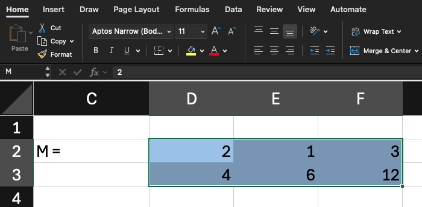
::::

:::: {.column width="50%"}
[En R]{.emphasis}

```{r}
c <- c(2, 1, 3, 4, 6, 12)
c

M <- matrix(c, nrow = 2, ncol = 3, byrow = TRUE)
M
```

::: {.callout-note title="Matrices en Excel" icon="false"}
Seleccione un rango y asígnele un nombre en el Cuadro de nombres. Para hacer operaciones matriciales, seleccione un rango con las dimensiones del resultado, escriba `=` seguido de la fórmula y presione CTRL + ENTER. Esto envolverá a la fórmula entre `{ }` como se verá más adelante en la diapositiva de [Suma](#suma) lo cual señalará que se trata de una operación matricial.
:::
::::
:::::::

## Índices

:::::: columns
:::: {.column width="50%"}
[Notación]{.emphasis}

$$
\mathbf{M} = \begin{bmatrix} 2 & 1 & 3 \\ 4 & 6 & 12 \end{bmatrix}
$$

$$
m_{23} = 12 \qquad m_{22} = 6
$$

$$
\mathbf{c}' = \begin{bmatrix} 2 & 1 & 3 & 4 & 6 & 12 \end{bmatrix} \qquad c_5 = 6
$$

[En Excel]{.emphasis}

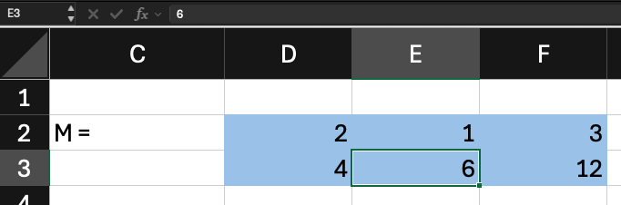
::::

::: {.column width="50%"}
[En R]{.emphasis}

```{r}
M[2, 3]
M[2, 2]

# En vectores, por posición
c[5]
```
:::
::::::

## Suma {#suma}

:::::: columns
:::: {.column width="50%"}
[Notación]{.emphasis}

$$
\mathbf{S} = \mathbf{M} + \mathbf{N}, \quad s_{ij} = m_{ij} + n_{ij}
$$

$$
\mathbf{N} = \begin{bmatrix} 1 & 2 & 3 \\ 3 & 2 & 1 \end{bmatrix}, \quad \mathbf{S} = \begin{bmatrix} 3 & 3 & 6 \\ 7 & 8 & 13 \end{bmatrix}
$$

[En Excel]{.emphasis}

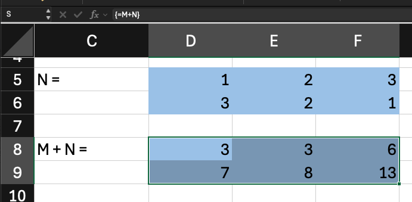
::::

::: {.column width="50%"}
[En R]{.emphasis}

```{r}
N <- matrix(
  c(1,2,3, 3,2,1), 
  nrow = 2, 
  ncol = 3, 
  byrow = TRUE
  )
N

dim(M)
dim(N)
dim(M) == dim(N)

S <- M + N
S
```
:::
::::::

## Suma de matrices de dimensiones diferentes no definida

:::::: columns
:::: {.column width="50%"}
[Notación]{.emphasis}

$$
\mathbf{M}_{2 \times 3} + \mathbf{O}_{2 \times 2}
$$

$$
\mathbf{M} = \begin{bmatrix} 2 & 1 & 3 \\ 4 & 6 & 12 \end{bmatrix} \qquad \mathbf{O} = \begin{bmatrix} 2 & 2 \\ 3 & 4 \end{bmatrix}
$$

[En Excel]{.emphasis}

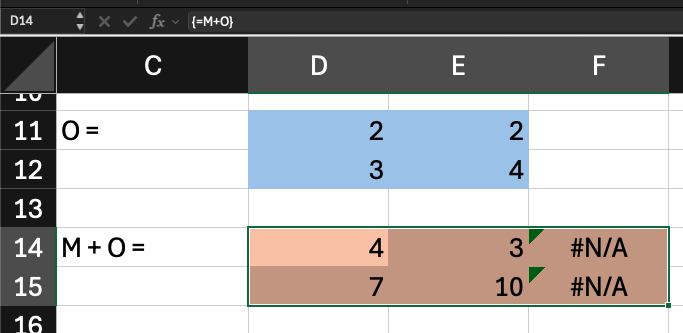
::::

::: {.column width="50%"}
[En R]{.emphasis}

Como esta operación matricial no está definida, R la marca como un error.

```{r}
#| error: true

O <- matrix(c(2,2,3,4), ncol = 2, nrow = 2, byrow = TRUE)
M
O

M + O
```
:::
::::::

## Resta

:::::: columns
:::: {.column width="50%"}
[Notación]{.emphasis}

$$
\mathbf{D} = \mathbf{M} - \mathbf{N}, \quad d_{ij} = m_{ij} - n_{ij}
$$

$$
\mathbf{D} = \begin{bmatrix} 1 & -1 & 0 \\ 1 & 4 & 11 \end{bmatrix}
$$

[En Excel]{.emphasis}

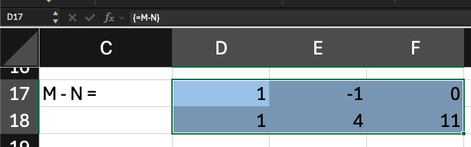
::::

::: {.column width="50%"}
[En R]{.emphasis}

```{r}
D <- M - N
M
N
D
```
:::
::::::

## Igualdad

:::::: columns
:::: {.column width="50%"}
[Notación]{.emphasis}

$$
\mathbf{A} = \mathbf{B} \iff a_{ij} = b_{ij} \ \ \forall \, i, j
$$

$$
\text{dim}(\mathbf{A}) = \text{dim}(\mathbf{B})
$$

[En Excel]{.emphasis}

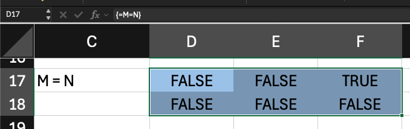
::::

::: {.column width="50%"}
[En R]{.emphasis}

```{r}
dim(M) == dim(N) # mismas dimensiones
M
N
M == N # comparación elemento por elemento
all(M == N) # todos los elementos no son iguales
M2 <- M
M2
all(M == M2) # todos los e
```
:::
::::::

## La matriz nula

:::::: columns
:::: {.column width="50%"}
[Notación]{.emphasis}

$$
\mathbf{0} = \begin{bmatrix} 0 & 0 & 0 \\ 0 & 0 & 0 \end{bmatrix}
$$

$$
\mathbf{M} + \mathbf{0} = \mathbf{M}
$$

[En Excel]{.emphasis}

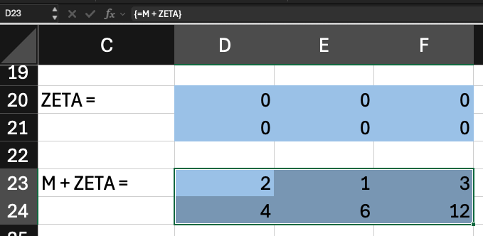
::::

::: {.column width="50%"}
[En R]{.emphasis}

```{r}
Z <- matrix(
  c(0,0,0, 0,0,0), 
  nrow = 2, 
  ncol = 3, 
  byrow = TRUE)
M
Z

M + Z
```
:::
::::::

## Multiplicación por un escalar

Se multiplica cada elemento de la matriz por el valor único y se coloca el resultado en los mismos lugares de una matriz con las mismas dimensiones a la matriz por la cual se está multiplicando el escalar. Esto es útil, por ejemplo, para multiplicar por un tipo de cambio.

:::::: columns
:::: {.column width="50%"}
[Notación]{.emphasis}

$$
k\mathbf{M} = [\, k \, m_{ij} \,]
$$

$$
2\mathbf{M} = \begin{bmatrix} 4 & 2 & 6 \\ 8 & 12 & 24 \end{bmatrix}
$$

[En Excel]{.emphasis}

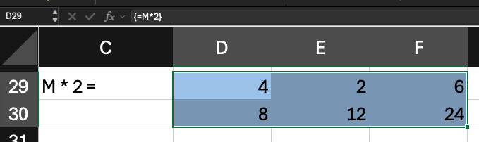
::::

::: {.column width="50%"}
[En R]{.emphasis}

```{r}
M

Mx2 <- M * 2
Mx2
```
:::
::::::

## Multiplicación de matrices: definición

Sean $\mathbf{M}$ de dimensión $m \times r$ y $\mathbf{Q}$ de dimensión $r \times n$. Las matrices son conformables para la multiplicación cuando el número de columnas de la primera es igual al número de filas de la segunda.

$$
\mathbf{P}_{m \times n} = \mathbf{M}_{m \times r} \, \mathbf{Q}_{r \times n}; \quad p_{ij} = \sum_{k=1}^{r} m_{ik} \, q_{kj}
$$

Cada elemento $p_{ij}$ es la suma de los productos de los elementos de la fila $i$ de $\mathbf{M}$ por los elementos de la columna $j$ de $\mathbf{Q}$ [@millerblair2022]. La matriz resultante $\mathbf{P}$ es de dimensión $m \times n$: tiene el número de filas de $\mathbf{M}$ y el número de columnas de $\mathbf{Q}$.

En general, $\mathbf{M}\mathbf{Q} \neq \mathbf{Q}\mathbf{M}$ , y a veces solo uno de los dos productos está definido.

::: {style="font-size: 0.8em"}
$$
\begin{bmatrix} 2 & 1 & 3 \\ 4 & 6 & 12 \end{bmatrix}
\times
\begin{bmatrix} 2 & 0 & 4 \\ 1 & 1 & 2 \\ 3 & 4 & 5 \end{bmatrix}
=
\begin{bmatrix}
2 \cdot 2 + 1 \cdot 1 + 3 \cdot 3 & 2 \cdot 0 + 1 \cdot 1 + 3 \cdot 4 & 2 \cdot 4 + 1 \cdot 2 + 3 \cdot 5 \\
4 \cdot 2 + 6 \cdot 1 + 12 \cdot 3 & 4 \cdot 0 + 6 \cdot 1 + 12 \cdot 4 & 4 \cdot 4 + 6 \cdot 2 + 12 \cdot 5
\end{bmatrix}
$$
:::

## Multiplicación de matrices: en la práctica

:::::: columns
:::: {.column width="50%"}
[Notación]{.emphasis}

$$
\mathbf{P}_{m \times n} = \mathbf{M}_{m \times r} \, \mathbf{Q}_{r \times n}; \quad p_{ij} = \sum_{k=1}^{r} m_{ik} \, q_{kj}
$$

$$
\mathbf{P} = \begin{bmatrix} 14 & 13 & 25 \\ 50 & 54 & 88 \end{bmatrix}
$$

[En Excel]{.emphasis}

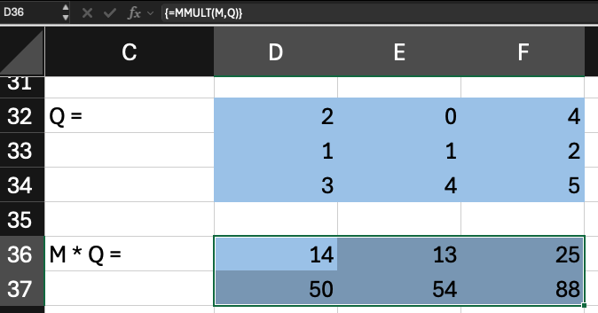
::::

::: {.column width="50%"}
[En R]{.emphasis}

```{r}
Q <- matrix(
  c(2,0,4, 1,1,2, 3,4,5), 
  nrow = 3, 
  ncol = 3, 
  byrow = TRUE)
Q

# A mano
c(
  (2*2 + 1*1 + 3*3),(2*0 + 1*1 + 3*4),(2*4 + 1*2 + 3*5),
  (4*2 + 6*1 + 12*3),(4*0 + 6*1 + 12*4),(4*4 + 6*2 + 12*5)
 )

P <- M %*% Q
P
```
:::
::::::

## Multiplicación no conformable

:::::: columns
:::: {.column width="50%"}
[Notación]{.emphasis}

$$
\mathbf{Q}_{3 \times 3} \, \mathbf{M}_{2 \times 3} \text{ no es conformable}
$$

$$
3 \neq 2
$$

[En Excel]{.emphasis}

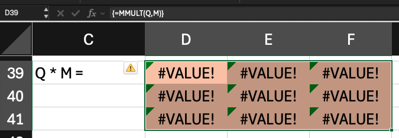
::::

::: {.column width="50%"}
[En R]{.emphasis}

Q tiene 3 columnas y M solo 2 filas

```{r}
#| error: true
Q %*% M
```
:::
::::::

## Identidad: el intento incorrecto

:::::: columns
::: {.column width="50%"}
Intuitivamente pensamos que una matriz de unos es el equivalente al 1 del álgebra normal, es decir un número por el cual yo puedo multiplicar a otro número y obtener como resultado ese mismo número. Pero esto es incorrecto.

[Notación]{.emphasis}

$$
\mathbf{M} = \begin{bmatrix} 2 & 1 & 3 \\ 4 & 6 & 12 \end{bmatrix} \times \mathbf{J} = \begin{bmatrix} 1 & 1 & 1 \\ 1 & 1 & 1 \\ 1 & 1 & 1 \end{bmatrix}
$$

$$
\mathbf{M}\mathbf{J} = \begin{bmatrix} 6 & 6 & 6 \\ 22 & 22 & 22 \end{bmatrix} \neq \mathbf{M}
$$
:::

:::: {.column width="50%"}
[En Excel]{.emphasis}

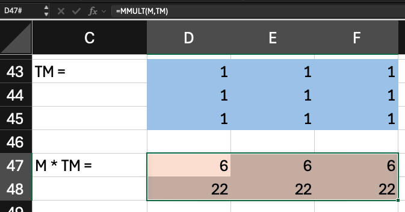

[En R]{.emphasis}

```{r}
# Una matriz de 1s no es la identidad
M %*% matrix(1, nrow = 3, ncol = 3)
```
::::
::::::

## Matriz identidad: posmultiplicación

:::::: columns
:::: {.column width="50%"}
[Notación]{.emphasis}

Una matriz diagonal de unos es la matriz identidad correcta.

$$
\mathbf{I}_3 = \begin{bmatrix} 1 & 0 & 0 \\ 0 & 1 & 0 \\ 0 & 0 & 1 \end{bmatrix} \qquad  \mathbf{M}\mathbf{I} = \mathbf{M}
$$

[En Excel]{.emphasis}

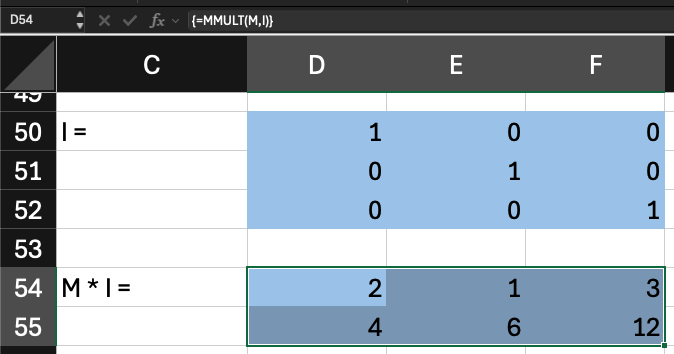
::::

::: {.column width="50%"}
[En R]{.emphasis}

```{r}
I <- matrix(
  c(1,0,0, 0,1,0, 0,0,1), 
  nrow = 3, 
  ncol = 3, 
  byrow = TRUE)

I
M

M %*% I
```
:::
::::::

## Identidad para matrices grandes

:::::: columns
:::: {.column width="50%"}
[Notación]{.emphasis}

$$
\mathbf{I}_n: \ \delta_{ij} = \begin{cases} 1 & i = j \\ 0 & i \neq j \end{cases}
$$

[En Excel]{.emphasis}

Seleccionar todo el rango y usar `=MUNIT()`.

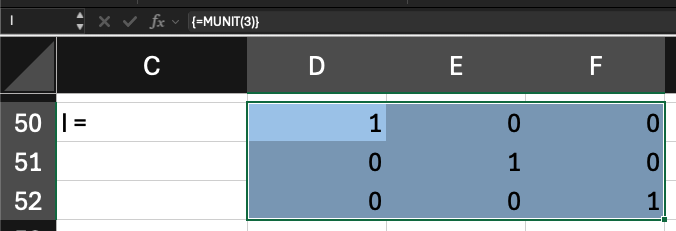
::::

::: {.column width="50%"}
[En R]{.emphasis}

```{r}
dim(M)
dim(M)[1]
dim(M)[2]

I3 <- diag(3)
I3

diag(dim(M)[2])
```
:::
::::::

## Matriz identidad: premultiplicación

:::::: columns
:::: {.column width="50%"}
[Notación]{.emphasis}

$$
\mathbf{I}_2 = \begin{bmatrix} 1 & 0 \\ 0 & 1 \end{bmatrix}
$$

$$
\mathbf{I}\mathbf{M} = \mathbf{M}
$$

[En Excel]{.emphasis}

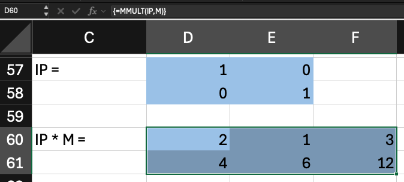
::::

::: {.column width="50%"}
[En R]{.emphasis}

```{r}
diag(dim(M)[1]) %*% M
```
:::
::::::

## Transposición

::::: columns
::: {.column width="50%"}
[Notación]{.emphasis}

$$
\mathbf{M}' = \mathbf{M}^{T}, \quad (\mathbf{M}')_{ij} = m_{ji}
$$

$$
\mathbf{M}' = \begin{bmatrix} 2 & 4 \\ 1 & 6 \\ 3 & 12 \end{bmatrix}
$$

[En Excel]{.emphasis}

Usar `TRANSPONER()` o `TRANSPOSE()`.
:::

::: {.column width="50%"}
[En R]{.emphasis}

```{r}
Mt <- t(M)
Mt
```
:::
:::::

## Transposición de vectores

::::: columns
::: {.column width="50%"}
[Notación]{.emphasis}

$$
\mathbf{c}' = \begin{bmatrix} 2 & 1 & 3 & 4 & 6 & 12 \end{bmatrix}
$$

$$
(\mathbf{c}')' = \mathbf{c}
$$

[En Excel]{.emphasis}

Usar `TRANSPONER()` o `TRANSPOSE()`)
:::

::: {.column width="50%"}
[En R]{.emphasis}

En R, los vectores no tienen dimensiones. R los conforma como fila o columna al multiplicar, siempre que su largo sea el requerido para la pre o posmultiplicación. Pero se puede forzar al convertirlos en matrices y transponerlas según sea necesario.

```{r}
t(c) # transpone y convierte un vector en matriz
t(t(c))
```
:::
:::::

## Sistemas de ecuaciones lineales

Un sistema de $n$ ecuaciones lineales con $n$ incógnitas tiene la forma:

$$
\begin{aligned}
a_{11}x_1 + a_{12}x_2 + \cdots + a_{1n}x_n &= b_1 \\
&\vdots \\
a_{n1}x_1 + a_{n2}x_2 + \cdots + a_{nn}x_n &= b_n
\end{aligned}
$$

Se puede representar como $\mathbf{A}\mathbf{x} = \mathbf{b}$, donde $\mathbf{A} = [\, a_{ij} \,]$ es la matriz de coeficientes ($n \times n$), $\mathbf{x}$ es el vector de incógnitas ($n \times 1$) y $\mathbf{b}$ es el vector de constantes ($n \times 1$).

Por ejemplo:

$$
\begin{aligned}
2x_1 + x_2 &= 10 \\
5x_1 + 3x_2 &= 26
\end{aligned}
\quad \Rightarrow \quad
\begin{bmatrix} 2 & 1 \\ 5 & 3 \end{bmatrix}\begin{bmatrix} x_1 \\ x_2 \end{bmatrix} = \begin{bmatrix} 10 \\ 26 \end{bmatrix}
$$

## Sistemas de ecuaciones lineales: en la práctica

:::::: columns
:::: {.column width="50%"}
[En Excel]{.emphasis}

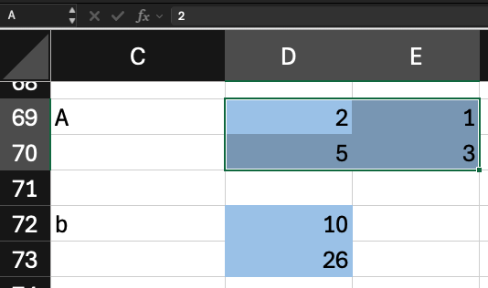
::::

::: {.column width="50%"}
[En R]{.emphasis}

```{r}
# 2x_1 +  x_2 = 10
# 5x_1 + 3x_2 = 26
A <- matrix(c(2,1,5,3), nrow = 2, ncol = 2, byrow = TRUE)
b <- matrix(c(10, 26), nrow = 2, ncol = 1, byrow = TRUE)
A
b
```
:::
::::::

## La división de matrices

Para resolver $\mathbf{A}\mathbf{x} = \mathbf{b}$, la idea intuitiva es dividir $\mathbf{b}$ entre $\mathbf{A}$, como en el álgebra de números:

$$
ax = b \quad \Rightarrow \quad x = \frac{b}{a} = a^{-1}b
$$

La división de matrices no está definida. En su lugar se usa la inversa de $\mathbf{A}$, denotada $\mathbf{A}^{-1}$, que es la matriz que al multiplicarla por $\mathbf{A}$ da la matriz identidad $\mathbf{I}$ [@millerblair2022]:

$$
\mathbf{A}^{-1}\mathbf{A} = \mathbf{A}\mathbf{A}^{-1} = \mathbf{I}
$$

La inversa cumple el papel del recíproco de un número, que al multiplicarlo por el número da 1, y la identidad cumple el papel del 1. Al premultiplicar ambos lados de la ecuación por $\mathbf{A}^{-1}$:

$$
\mathbf{A}^{-1}\mathbf{A}\mathbf{x} = \mathbf{A}^{-1}\mathbf{b} \quad \Rightarrow \quad \mathbf{x} = \mathbf{A}^{-1}\mathbf{b}
$$

## La inversa

:::::: columns
:::: {.column width="50%"}
[Notación]{.emphasis}

$$
\mathbf{A}^{-1} = \begin{bmatrix} 3 & -1 \\ -5 & 2 \end{bmatrix} \qquad \mathbf{A}\mathbf{A}^{-1} = \mathbf{I}
$$

[En Excel]{.emphasis}

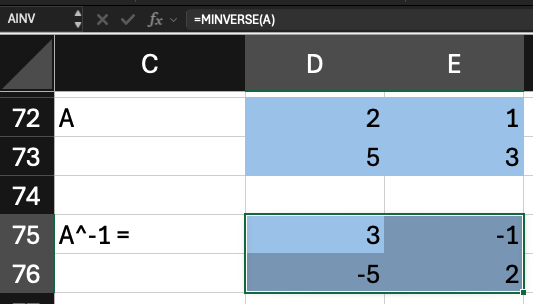
::::

::: {.column width="50%"}
[En R]{.emphasis}

```{r}
A
solve(A)
```
:::
::::::

## La inversa a mano: eliminación de Gauss-Jordan

Dada una matriz $\mathbf{A}$ de $n \times n$, se arma una matriz ampliada de $n \times 2n$ que une a $\mathbf{A}$ con la identidad $\mathbf{I}$ de $n \times n$: $[\, \mathbf{A} \mid \mathbf{I} \,]$. Se trabaja columna por columna, de izquierda a derecha, con tres operaciones permitidas entre filas. Para cada columna, en este orden:

1.  Intercambiar dos filas ($F_i \leftrightarrow F_j$): si el elemento de la diagonal (el pivote) es 0, sube una fila con un valor distinto de 0.
2.  Multiplicar una fila por un número distinto de 0 ($F_i \leftarrow kF_i$): convierte el pivote en 1.
3.  Sumar a una fila un múltiplo de otra ($F_i \leftarrow F_i + kF_j$): convierte en 0 el resto de la columna, arriba y abajo del pivote.

Las tres operaciones son reversibles y no cambian la solución del sistema. Aplicadas a la matriz ampliada convierten $\mathbf{A}$ en $\mathbf{I}$, y la $\mathbf{I}$ original en $\mathbf{A}^{-1}$. Si en alguna columna no se encuentra un pivote distinto de 0, la matriz no tiene inversa.

## La inversa a mano: eliminación de Gauss-Jordan

Se aplican operaciones entre filas a la matriz ampliada $[\, \mathbf{A} \mid \mathbf{I} \,]$ hasta convertir $\mathbf{A}$ en $\mathbf{I}$. Lo que queda a la derecha es $\mathbf{A}^{-1}$.

::::: columns
::: {.column width="50%"}
[Inicio]{.emphasis}

$$
\left[\begin{array}{cc|cc} 2 & 1 & 1 & 0 \\ 5 & 3 & 0 & 1 \end{array}\right]
$$

[1. $F_1 \leftarrow F_1 / 2$]{.emphasis}

$$
\left[\begin{array}{cc|cc} 1 & \tfrac{1}{2} & \tfrac{1}{2} & 0 \\ 5 & 3 & 0 & 1 \end{array}\right]
$$

[2. $F_2 \leftarrow F_2 - 5F_1$]{.emphasis}

$$
\left[\begin{array}{cc|cc} 1 & \tfrac{1}{2} & \tfrac{1}{2} & 0 \\ 0 & \tfrac{1}{2} & -\tfrac{5}{2} & 1 \end{array}\right]
$$
:::

::: {.column width="50%"}
[3. $F_2 \leftarrow 2F_2$]{.emphasis}

$$
\left[\begin{array}{cc|cc} 1 & \tfrac{1}{2} & \tfrac{1}{2} & 0 \\ 0 & 1 & -5 & 2 \end{array}\right]
$$

[4. $F_1 \leftarrow F_1 - \tfrac{1}{2}F_2$]{.emphasis}

$$
\left[\begin{array}{cc|cc} 1 & 0 & 3 & -1 \\ 0 & 1 & -5 & 2 \end{array}\right]
$$

[Resultado y verificación]{.emphasis}

$$
\mathbf{A}^{-1} = \begin{bmatrix} 3 & -1 \\ -5 & 2 \end{bmatrix}, \quad \mathbf{A}\mathbf{A}^{-1} = \mathbf{I}
$$
:::
:::::

## Matrices sin inversa

:::::: columns
:::: {.column width="50%"}
[Notación]{.emphasis}

$$
\mathbf{C} = \begin{bmatrix} 2 & 6 \\ 4 & 12 \end{bmatrix}, \quad |\mathbf{C}| = 0
$$

$$
\nexists \, \mathbf{C}^{-1}
$$

[En Excel]{.emphasis}

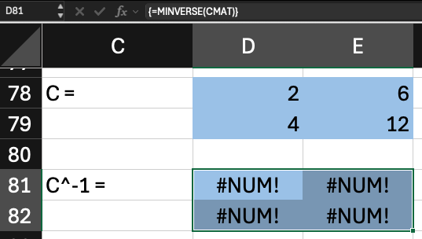
::::

::: {.column width="50%"}
[En R]{.emphasis}

```{r}
#| error: true
# Productos cruzados iguales: matriz singular
C <- matrix(c(2,4,6,12), nrow = 2, ncol = 2)
solve(C)
```
:::
::::::

## Solución del sistemas de ecuaciones

:::::: columns
:::: {.column width="50%"}
[Notación]{.emphasis}

$$
\mathbf{x} = \mathbf{A}^{-1}\mathbf{b} = \begin{bmatrix} 4 \\ 2 \end{bmatrix}
$$

[En Excel]{.emphasis}

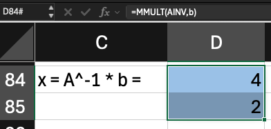
::::

::: {.column width="50%"}
[En R]{.emphasis}

```{r}
A
b
x <- solve(A) %*% b
x
```
:::
::::::

## Matrices diagonales

:::::: columns
:::: {.column width="50%"}
[Notación]{.emphasis}

$$
\mathbf{g}' = \begin{bmatrix} 8 & 9 & 17 \end{bmatrix} \quad \hat{\mathbf{g'}} = \begin{bmatrix} 8 & 0 & 0 \\ 0 & 9 & 0 \\ 0 & 0 & 17 \end{bmatrix}
$$

[En Excel]{.emphasis}

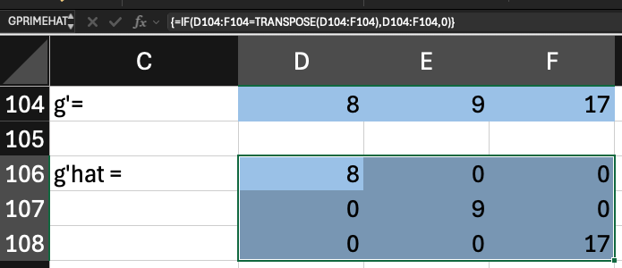
::::

::: {.column width="50%"}
[En R]{.emphasis}

```{r}
g <- c(8,9,17)
g

# Q sombrero: solo la diagonal
Ghat <- diag(g)
Ghat
```
:::
::::::

## Inversa de una matriz diagonal

::::: columns
::: {.column width="50%"}
[Notación]{.emphasis}

$$
\hat{\mathbf{G}}^{-1} = \begin{bmatrix} 1/8 & 0 & 0 \\ 0 & 1/9 & 0 \\ 0 & 0 & 1/17 \end{bmatrix} ; \quad \hat{\mathbf{G}}^{-1}\hat{\mathbf{G}} = \mathbf{I}
$$

[En Excel]{.emphasis}

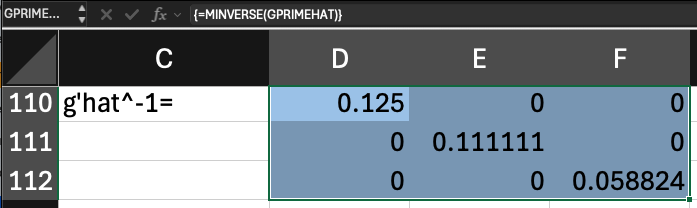

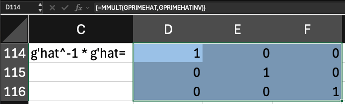
:::

::: {.column width="50%"}
[En R]{.emphasis}

```{r}
Ghat
invGhat <- solve(Ghat)
invGhat

invGhat %*% Ghat
```
:::
:::::

## Vectores sumatorios: suma de filas

:::::: columns
:::: {.column width="50%"}
[Notación]{.emphasis}

$$
\mathbf{i} = \begin{bmatrix} 1 \\ 1 \\ 1 \end{bmatrix} \quad \mathbf{M}\mathbf{i} = \begin{bmatrix} 6 \\ 22 \end{bmatrix}
$$

[En Excel]{.emphasis}

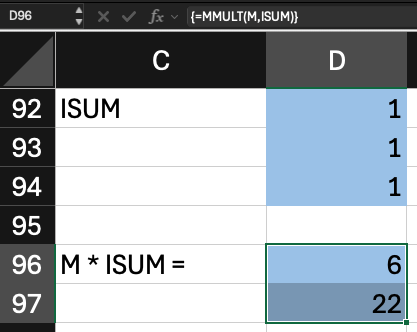
::::

::: {.column width="50%"}
[En R]{.emphasis}

```{r}
M
isum <- matrix(1, nrow = 3, ncol = 1)
M %*% isum
#Alternativamente
M %*% c(1,1,1)
```
:::
::::::

## Vectores sumatorios: suma de columnas

:::::: columns
:::: {.column width="50%"}
[Notación]{.emphasis}

$$
\mathbf{i}' = \begin{bmatrix} 1 & 1 \end{bmatrix} \quad \mathbf{i}'\mathbf{M} = \begin{bmatrix} 6 & 7 & 15 \end{bmatrix}
$$

[En Excel]{.emphasis}

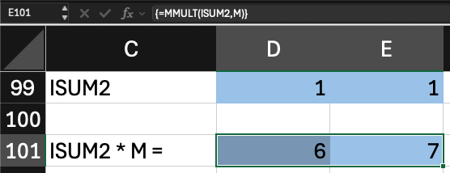
::::

::: {.column width="50%"}
[En R]{.emphasis}

```{r}
matrix(1, ncol = 2, nrow = 1) %*% M

c(1,1) %*% M
```
:::
::::::

## Atajos en Excel y en R

::::: columns
::: {.column width="50%"}
[En Excel]{.emphasis}

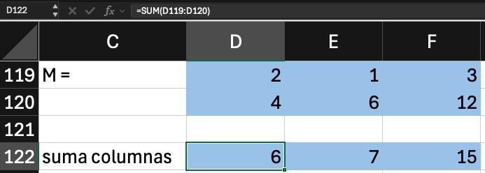 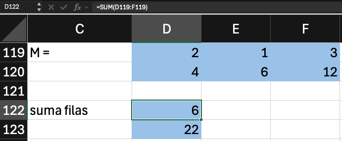
:::

::: {.column width="50%"}
[En R]{.emphasis}

```{r}
colSums(M)
rowSums(M)
```
:::
:::::

## Bibliografía {.theme-content}

::: {#refs}
:::

##  {.theme-blank .center}

::::::: columns
::: {.column width="15%"}
:::

:::: {.column width="70%"}
::: {style="text-align: center"}
[¡Gracias!]{style="font-size:2.2em;color:#204B92;"}

[**Renato Vargas**]{style="font-size:1.2em;"}

[[LinkedIn](https://renatovargas.com/) | [website](https://renatovargas.com/)]{style="font-size:0.9em;"}
:::
::::

::: {.column width="15%"}
:::
:::::::
