## Temas a tratar {.theme-content}

1.  El modelo básico.
2.  Coeficientes técnicos y matriz de Leontief.
3.  Cambios en la demanda final.

##  {.theme-blank .center}

::: {style="text-align: center"}

**Descargar los archivos de ejemplo:**

| | |
| :--- | :----------: |
| | |
| [Excel:]{.emphasis} | [modelo-insumo-producto.xlsx](../../datos/ejemplos/modelo-insumo-producto.xlsx){.button download="modelo-insumo-producto.xlsx"} |
| [R:]{.emphasis} | [modelo-insumo-producto.R](../../datos/ejemplos/modelo-insumo-producto.R){.button download="modelo-insumo-producto.R"} |
| | |
:::

## El modelo básico {#modelo-basico}

Una economía de dos sectores, agricultura y manufacturas, se describe con un cuadro de flujos entre industrias [@millerblair2022]. Cada fila muestra a quién vende un sector; cada columna muestra qué compra para producir.

|                  |   Agricultura |  Manufacturas | Demanda final | Producto total |
|---------------|--------------:|--------------:|--------------:|--------------:|
| Agricultura      |  [150]{.bg-Z} |  [500]{.bg-Z} |  [350]{.bg-f} |  [1000]{.bg-x} |
| Manufacturas     |  [200]{.bg-Z} |  [100]{.bg-Z} | [1700]{.bg-f} |  [2000]{.bg-x} |
| Pagos a factores |           650 |          1400 |          1100 |                |
| Total insumos    | [1000]{.bg-x} | [2000]{.bg-x} |          3150 |                |

- Los flujos entre industrias forman la matriz [$\mathbf{Z}$]{.bg-Z}.
- La demanda final forma el vector [$\mathbf{f}$]{.bg-f}.
- El producto total forma el vector [$\mathbf{x}$]{.bg-x}, que aparece como columna y también como fila (el vector $\mathbf{x}'$ de los totales de insumos).
- Para cada sector, el producto total es la suma de lo que se vende a otros sectores más la demanda final: [$\mathbf{x}$]{.bg-x} = $\mathbf{Z}\mathbf{i}$ + [$\mathbf{f}$]{.bg-f}.

## Cuadro de flujos entre industrias

El elemento $z_{ij}$ de la matriz [$\mathbf{Z}$]{.bg-Z} muestra las ventas que hace la fila $i$ a la columna $j$, o bien las compras que hace la columna $j$ a la fila $i$.

::::: columns
::: {.column width="50%"}
[Notación]{.emphasis}

$$
\bbox[#B5E6A2,3px]{\mathbf{Z}} = \begin{bmatrix} 150 & 500 \\ 200 & 100 \end{bmatrix}
$$

[En Excel]{.emphasis}

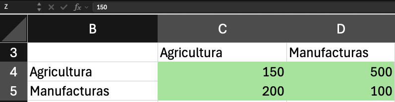
:::

::: {.column width="50%"}
[En R]{.emphasis}

Primero creamos el cuadro de flujos.

```{r}
#| echo: false

Z <- matrix(
  c(150, 500, 200, 100), 
  nrow = 2, 
  ncol = 2, 
  byrow = TRUE)

sectores <- c("Agricultura", "Manufacturas")
colnames(Z) <- sectores
rownames(Z) <- sectores
```

```{r}
Z
```
:::
:::::

## Demanda final y producto total

La demanda final del cuadro forma el vector [$\mathbf{f}$]{.bg-f} y el producto total forma el vector [$\mathbf{x}$]{.bg-x}.

::::: columns
::: {.column width="50%"}
[Notación]{.emphasis}

$$
\bbox[#F2CEEF,3px]{\mathbf{f}} = \begin{bmatrix} 350 \\ 1700 \end{bmatrix} \qquad \bbox[#A6C9EC,3px]{\mathbf{x}} = \begin{bmatrix} 1000 \\ 2000 \end{bmatrix}
$$

[En Excel]{.emphasis}

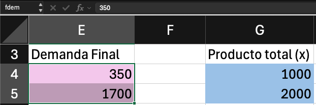
:::

::: {.column width="50%"}
[En R]{.emphasis}

```{r}
# Demanda final, según el cuadro
f <- c(350, 1700)
f

# Producto total
x <- c(1000, 2000)
x
```
:::
:::::

## Matriz diagonal de producto

Para pasar de flujos a coeficientes se necesita una matriz diagonal con el producto total [$\mathbf{x}$]{.bg-x} de cada sector, $\widehat{\mathbf{x}}$.

::::: columns
::: {.column width="50%"}
[Notación]{.emphasis}

$$
\bbox[#A6C9EC,3px]{\widehat{\mathbf{x}}} = \begin{bmatrix} 1000 & 0 \\ 0 & 2000 \end{bmatrix}
$$

[En Excel]{.emphasis}

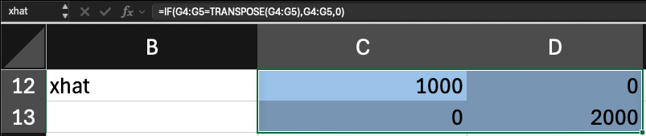
:::

::: {.column width="50%"}
[En R]{.emphasis}

```{r}
xhat <- diag(x)
xhat
```
:::
:::::

## Coeficientes técnicos: definición {#coeficientes}

El coeficiente técnico $a_{ij}$ es la cantidad que el sector $j$ compra al sector $i$ por cada unidad monetaria que produce. Se obtiene al dividir cada flujo entre el producto total del sector comprador [@millerblair2022].

$$
a_{ij} = \frac{\bbox[#B5E6A2,3px]{z_{ij}}}{\bbox[#A6C9EC,3px]{x_j}} \qquad \Longleftrightarrow \qquad \mathbf{A} = \bbox[#B5E6A2,3px]{\mathbf{Z}}\bbox[#A6C9EC,3px]{\widehat{\mathbf{x}}}^{-1}
$$

Posmultiplicar por la inversa de la matriz diagonal divide cada columna de [$\mathbf{Z}$]{.bg-Z} entre el producto [$\mathbf{x}$]{.bg-x} del sector correspondiente. Despejando, $\mathbf{Z} = \mathbf{A}\widehat{\mathbf{x}}$.

|              | Agricultura | Manufacturas |
|--------------|------------:|-------------:|
| Agricultura  |        0.15 |         0.25 |
| Manufacturas |        0.20 |         0.05 |

## Coeficientes técnicos: en la práctica

::::: columns
::: {.column width="50%"}
[Notación]{.emphasis}

$$
\mathbf{A} = \bbox[#B5E6A2,3px]{\mathbf{Z}}\bbox[#A6C9EC,3px]{\widehat{\mathbf{x}}}^{-1} = \begin{bmatrix} 0.15 & 0.25 \\ 0.20 & 0.05 \end{bmatrix}
$$

[En Excel]{.emphasis}

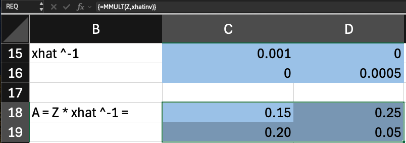
:::

::: {.column width="50%"}
[En R]{.emphasis}

```{r}
A <- Z %*% solve(xhat)
A
```
:::
:::::

## La matriz de Leontief: planteamiento {#leontief}

El producto de cada sector satisface las compras de los demás sectores y a la demanda final:

$$
\bbox[#A6C9EC,3px]{\mathbf{x}} = \mathbf{Z}\mathbf{i} + \bbox[#F2CEEF,3px]{\mathbf{f}}
$$

Los coeficientes permiten escribir las ventas a otros sectores en función del producto. Como $\mathbf{Z} = \mathbf{A}\widehat{\mathbf{x}}$ y multiplicar una matriz diagonal por el vector sumatorio devuelve el vector original, $\widehat{\mathbf{x}}\mathbf{i} = \mathbf{x}$ [@millerblair2022]:

$$
\mathbf{Z}\mathbf{i} = \mathbf{A}\widehat{\mathbf{x}}\mathbf{i} = \mathbf{A}\mathbf{x}
$$

Sustituyendo en la primera ecuación, el modelo queda expresado solo con $\mathbf{A}$, $\mathbf{x}$ y $\mathbf{f}$:

$$
\bbox[#A6C9EC,3px]{\mathbf{x}} = \mathbf{A}\bbox[#A6C9EC,3px]{\mathbf{x}} + \bbox[#F2CEEF,3px]{\mathbf{f}}
$$

## La matriz de Leontief: despeje de $\mathbf{x}$

Queremos $\mathbf{x}$ en función de $\mathbf{f}$. Pasamos $\mathbf{A}\mathbf{x}$ restando al lado izquierdo:

$$
\mathbf{x} - \mathbf{A}\mathbf{x} = \mathbf{f}
$$

Para factorizar $\mathbf{x}$ no basta con escribir $(1 - \mathbf{A})\mathbf{x}$, porque no se puede restar un número a una matriz. Por eso se usa un truco: $\mathbf{x} = \mathbf{I}\mathbf{x}$, ya que la identidad no altera al vector. Así ambos términos son matriz por vector y se puede factorizar:

$$
\mathbf{I}\mathbf{x} - \mathbf{A}\mathbf{x} = \mathbf{f} \quad \Rightarrow \quad (\mathbf{I} - \mathbf{A})\mathbf{x} = \mathbf{f}
$$

La división de matrices no está definida, así que se premultiplican ambos lados por la inversa de $(\mathbf{I} - \mathbf{A})$. Como $(\mathbf{I} - \mathbf{A})^{-1}(\mathbf{I} - \mathbf{A}) = \mathbf{I}$ y $\mathbf{I}\mathbf{x} = \mathbf{x}$:

$$
\bbox[#A6C9EC,3px]{\mathbf{x}} = (\mathbf{I} - \mathbf{A})^{-1}\bbox[#F2CEEF,3px]{\mathbf{f}} = \bbox[#F7C7AC,3px]{\mathbf{L}}\bbox[#F2CEEF,3px]{\mathbf{f}}
$$

## La matriz de Leontief: interpretación

$$
\bbox[#F7C7AC,3px]{\mathbf{L}} = (\mathbf{I} - \mathbf{A})^{-1}
$$

[$\mathbf{L}$]{.bg-L} es la matriz inversa de Leontief. Es el mismo problema del sistema de ecuaciones lineales de la presentación anterior, con $\mathbf{I} - \mathbf{A}$ como matriz de coeficientes y $\mathbf{f}$ como vector de constantes, resuelto con la inversa [@millerblair2022].

Dice cuánto debe producir cada sector, directa e indirectamente, para satisfacer la demanda final.

## La identidad y la resta de I menos A

Para restar $\mathbf{A}$ necesitamos una identidad de la misma dimensión.

::::: columns
::: {.column width="50%"}
[Notación]{.emphasis}

$$
\mathbf{I} - \mathbf{A} = \begin{bmatrix} 0.85 & -0.25 \\ -0.20 & 0.95 \end{bmatrix}
$$

[En Excel]{.emphasis}

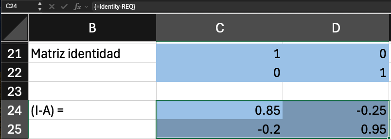
:::

::: {.column width="50%"}
[En R]{.emphasis}

```{r}
# Dimensiones de A
dim(A)

# Identidad de tamaño apropiado
I <- diag(dim(A)[1])
I

I - A
```
:::
:::::

## La matriz de Leontief: en la práctica

::::: columns
::: {.column width="50%"}
[Notación]{.emphasis}

$$
\bbox[#F7C7AC,3px]{\mathbf{L}} = (\mathbf{I} - \mathbf{A})^{-1} = \begin{bmatrix} 1.2541 & 0.3300 \\ 0.2640 & 1.1221 \end{bmatrix}
$$

[En Excel]{.emphasis}

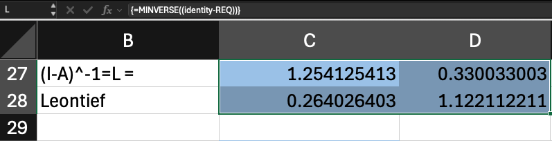
:::

::: {.column width="50%"}
[En R]{.emphasis}

```{r}
L <- solve(I - A)
L
```
:::
:::::

## Calibración del modelo

Un modelo está calibrado cuando reproduce los datos con los que se construyó. Si [$\mathbf{L}$]{.bg-L}$\mathbf{f}$ devuelve el producto total observado [$\mathbf{x}$]{.bg-x}, la matriz $\mathbf{A}$ y la matriz [$\mathbf{L}$]{.bg-L} son consistentes con el cuadro original.

::::: columns
::: {.column width="50%"}
[Notación]{.emphasis}

$$
\bbox[#F7C7AC,3px]{\mathbf{L}}\bbox[#F2CEEF,3px]{\mathbf{f}} = \begin{bmatrix} 1000 \\ 2000 \end{bmatrix} = \bbox[#A6C9EC,3px]{\mathbf{x}}
$$

[En Excel]{.emphasis}

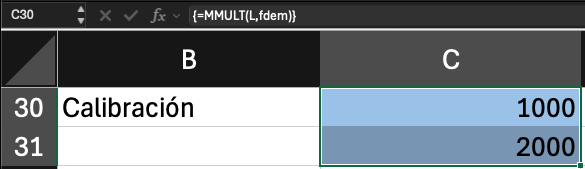
:::

::: {.column width="50%"}
[En R]{.emphasis}

```{r}
L %*% f
```
:::
:::::

## Cambios en la demanda final: planteamiento {#cambio-demanda}

Con el modelo calibrado se pueden hacer preguntas de escenarios.

Si la demanda final de los productos agrícolas se incrementa a USD 600 el siguiente año y la de las manufacturas baja a USD 1500, ¿cuánto producto de los dos sectores sería necesario para satisfacer esta nueva demanda?

$$
\bbox[#F2CEEF,3px]{\mathbf{f}_{nueva}} = \begin{bmatrix} 600 \\ 1500 \end{bmatrix} \qquad \bbox[#A6C9EC,3px]{\mathbf{x}_{nueva}} = \bbox[#F7C7AC,3px]{\mathbf{L}}\bbox[#F2CEEF,3px]{\mathbf{f}_{nueva}}
$$

La matriz [$\mathbf{L}$]{.bg-L} no cambia: se asume que la tecnología, es decir los coeficientes de $\mathbf{A}$, es la misma. Solo cambia la demanda.

## Cambios en la demanda final: en la práctica

::::: columns
::: {.column width="50%"}
[Notación]{.emphasis}

$$
\bbox[#A6C9EC,3px]{\mathbf{x}_{nueva}} = \bbox[#F7C7AC,3px]{\mathbf{L}}\bbox[#F2CEEF,3px]{\mathbf{f}_{nueva}} = \begin{bmatrix} 1247.53 \\ 1841.58 \end{bmatrix}
$$

[En Excel]{.emphasis}

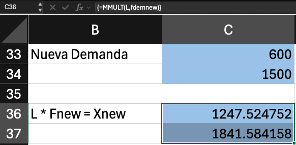
:::

::: {.column width="50%"}
[En R]{.emphasis}

```{r}
fnueva <- c(600, 1500)

xnueva <- L %*% fnueva
xnueva
```
:::
:::::

## El nuevo cuadro de flujos: la solución

::::: columns
::: {.column width="50%"}
[Notación]{.emphasis}

$$
\bbox[#B5E6A2,3px]{\mathbf{Z}_{nueva}} = \begin{bmatrix} 187.13 & 460.40 \\ 249.51 & 92.08 \end{bmatrix}
$$

[En Excel]{.emphasis}

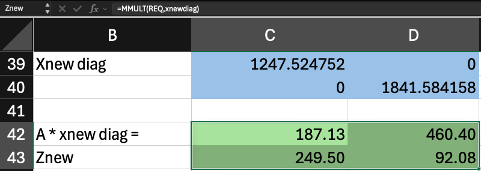
:::

::: {.column width="50%"}
[En R]{.emphasis}

Se convierte `xnueva` en vector con `c()` o con ` as.vector()`  para no cometer el error común por las diferentes formas enlas que funciona `diag()`.

```{r}
Znueva <- A %*% diag(c(xnueva))
Znueva <- A %*% diag(as.vector(xnueva))
Znueva
```
:::
:::::

## El nuevo cuadro completo

Los pagos a factores se obtienen como residuo: el producto de cada sector menos lo que compra a otros sectores.

::: {style="font-size: 0.85em"}
|   | Agricultura | Manufacturas | Demanda final | Producto total |
|---------------|--------------:|--------------:|--------------:|--------------:|
| Agricultura | [187.13]{.bg-Z} | [460.40]{.bg-Z} | [600]{.bg-f} | [1247.53]{.bg-x} |
| Manufacturas | [249.51]{.bg-Z} | [92.08]{.bg-Z} | [1500]{.bg-f} | [1841.58]{.bg-x} |
| Pagos a factores | 810.89 | 1289.11 | 1100 |  |
| Total insumos | [1247.53]{.bg-x} | [1841.58]{.bg-x} | 3200 |  |
:::

::::: columns
::: {.column width="50%"}
[En Excel]{.emphasis}

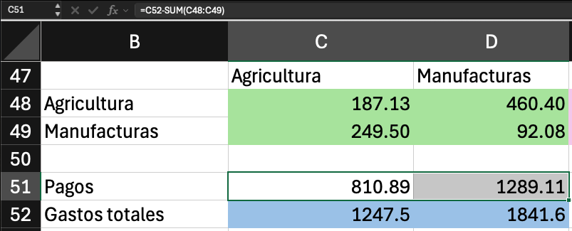
:::

::: {.column width="50%"}
[En R]{.emphasis}

```{r}
# Pagos a factores por sector
xnueva - colSums(Znueva)
```
:::
:::::

## Cambios en lugar de niveles

A veces interesan los cambios y no los nuevos niveles. Se restan los valores originales a los nuevos.

::::: columns
::: {.column width="50%"}
[Notación]{.emphasis}

$$
\Delta\mathbf{f} = \bbox[#F2CEEF,3px]{\mathbf{f}_{nueva}} - \bbox[#F2CEEF,3px]{\mathbf{f}} = \begin{bmatrix} 250 \\ -200 \end{bmatrix}
$$

$$
\Delta\mathbf{x} = \bbox[#A6C9EC,3px]{\mathbf{x}_{nueva}} - \bbox[#A6C9EC,3px]{\mathbf{x}} = \begin{bmatrix} 247.52 \\ -158.42 \end{bmatrix}
$$

[En Excel]{.emphasis}

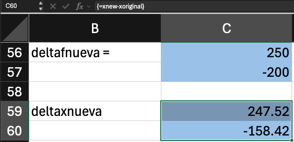
:::

::: {.column width="50%"}
[En R]{.emphasis}

```{r}
# Cambios en demanda
deltaf <- fnueva - f
deltaf

# Cambios en producto
deltax <- xnueva - x
deltax

# Cambios en toda la tabla Z
deltaZ <- Znueva - Z
deltaZ
```
:::
:::::

## Análisis final

El escenario cambió la demanda final, no la tecnología. El modelo traduce esos cambios en ajustes de la producción y de las compras entre sectores.

$$
\Delta\mathbf{f} = \begin{bmatrix} 250 \\ -200 \end{bmatrix} \quad \Rightarrow \quad \Delta\mathbf{x} = \begin{bmatrix} 247.52 \\ -158.42 \end{bmatrix} \quad \Rightarrow \quad \Delta\mathbf{Z} = \begin{bmatrix} 37.13 & -39.60 \\ 49.50 & -7.92 \end{bmatrix}
$$

- **Agricultura:** su demanda final sube USD 250 y su producción sube USD 247.52. Sube algo menos que la demanda porque manufacturas, que reduce su producción, le compra menos insumos.
- **Manufacturas:** su demanda final baja USD 200 y su producción baja USD 158.42. Baja menos que la demanda porque agricultura, al producir más, le compra más insumos.
- **Compras entre sectores:** cada columna de $\Delta\mathbf{Z}$ sigue el cambio de producción del sector comprador, con sus coeficientes técnicos. Agricultura produce más y aumenta sus compras en USD 37.13 a sí misma y en USD 49.50 a manufacturas. Manufacturas produce menos y reduce sus compras en USD 39.60 a agricultura y en USD 7.92 a sí misma.

## Conversión a moneda local

Es la multiplicación por un escalar que vimos en la presentación anterior. Con un tipo de cambio de 3.44 unidades de moneda local por 1 USD:

::::: columns
::: {.column width="50%"}
[Notación]{.emphasis}

$$
\Delta\mathbf{f}_{ML} = 3.44 \, \Delta\mathbf{f}
$$

[En Excel]{.emphasis}

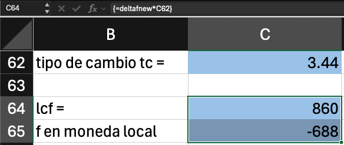
:::

::: {.column width="50%"}
[En R]{.emphasis}

```{r}
tc <- 3.44
deltaf * tc
deltax * tc
deltaZ * tc
```
:::
:::::

## Bibliografía {.theme-content}

::: {#refs}
:::

##  {.theme-blank .center}

::::::: columns
::: {.column width="15%"}
:::

:::: {.column width="70%"}
::: {style="text-align: center"}
[¡Gracias!]{style="font-size:2.2em;color:#204B92;"}

[**Renato Vargas**]{style="font-size:1.2em;"}

[[LinkedIn](https://renatovargas.com/) | [website](https://renatovargas.com/)]{style="font-size:0.9em;"}
:::
::::

::: {.column width="15%"}
:::
:::::::